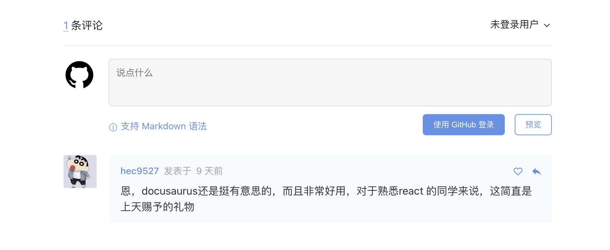

每次搬迁博客之前都很纠结到底要不要搬，毕竟博客搬迁费时费力，如果没有解决之前的痛点，得到想要的效果，收益小于付出，还不如维持现状专注以内容产出。但是当我第一看看到 docusaurus2 之后，我决定尝试一下。 docusaurus2 是由 react 构建，mdx 驱动的静态文档搭建工具。

<!-- truncate -->

## 为什么会选择 docusaurus2

之前用过很多博客托管网站，比如 CSDN、博客园、雨雀、docsify、gitbook 等，但没有一款能让人满意，CSDN 环境太差，商业气息浓重，很多人比如我，直接把 CSDN 加入了搜索引擎黑名单，用来写博客，推广起来比较麻烦。之前也用过博客园，但是博客园只支持富文本，并且博客园和 CSDN 一样有非常多质量很低的文章，通常都是复制粘贴别人的文章，甚至格式都不修改的，看到最后突然冒出来一个原文链接。 雨雀用得比较少，docsify 之前我用过，并且在 vercel 上面托管了一个博客，这也是我主要使用的博客，不过这个与其说是一个博客，倒不如说是一个文档，它的网站风格更多像是一个文档，不适合用来托管博客，同时也缺少很多博客的订阅信息。

至于为什么不用鼎鼎大名的 wordpress，是因为最开始的时候我的目标就很明确，静态博客。wordpress 需要后台不能简单的托管在 `github pages`, 也不能托管在其他的静态资源托管网站。最后在 hexo 和 docusaurus2 之间反复横跳，hexo 的优势就是它有非常丰富的网站主题，套用起来也很方便，可以把博客做得非常花里胡哨，但是我们写博客的目的是做好内容产出，而不是炫技，docusaurus2 使用 react 驱动，我们可以自由的扩展博客的功能，还可以在 mdx 文档中使用 react 组件，同时 docusaurus2 的默认样式也非常不错，不仅支持黑色主题，还适配移动端。

## 如何安装 docusaurus2

docusaurus2 官方有非常详细的中文文档了，安装使用可以直接查看官方文档，我这里就不做文档搬运这种无聊的事了

[docusaurus2 安装](https://docusaurus.io/zh-CN/docs/installation)

## 如何配置 `algolia` 搜索

使用 algolia 搜索，首先需要在项目中安装这个依赖，如果创建项目的时候使用的 `classic` 模板，那么项目中默认是安装过的

```shell
npm install --save @docusaurus/theme-search-algolia
```

前往 [algolia](Apply for DocSearch) 注册应用，并且生成 `Algolia` 索引和 `API Key`，生成 API key 需要添加 `addObject`, `delObject` 权限

```js title="docusaurus.config.js"
themeConfig: {
    // ...
    algolia: {
      appId: 'YOUR_APP_ID',   // 没有就用这个 BH4D9OD16A
      apiKey: 'YOUR_API_KEY',
      indexName: 'YOUR_INDEX_NAME',
      contextualSearch: true,
    },
    // ...
}
```

## 如何修改内置组件

之前差点因为 docusaurus2 缺乏定制化的能力而放弃， 然而 docusaurus2 提供了组件变换的工具，如果你对某个主题组件的功能或者样式不满意，可以使用将组件变换出来，修改其中的功能。比如我们想给博客添加评论的功能，自带的主题是不包括这个功能的，所以我们需要修改主题中的组件达到我们的目的。我们先将 `BlogPostPage` 组件变换出来，这个是用来展示博客内容以及分页等功能的组件，我们可以在这个里面插入评论功能，评论组件我们使用 gitalk。



```shell
# 使用这种方式弹出组件
npm run swizzle <theme name> [component name]
```

**插入评论组件分为以下几步**

1. 弹出我们想要修改的容器组件
2. 注册 github 应用
3. 使用 gitalk 编写评论组件
4. 在容器组件里面合适的地方插入评论组件

```shell
# 如果使用 npm 弹出组件报错，将npm替换成yarn
npm run swizzle @docusaurus/theme-classic BlogPostPage --danger
```

这里添加 `--danger`，是因为目前 docusaurus2 还处于 beta 阶段，部分内置组件可能会改变。接下来我们编写一个评论的组件， 首先需要安装 gitalk 依赖，然后去 [github 注册应用](https://github.com/settings/applications/new)。

```shell
npm i gitalk
```

```jsx title='src/theme/GitTalkCommit/index.tsx'
import React, { useEffect } from 'react';
import Gitalk from 'gitalk';
import 'gitalk/dist/gitalk.css';

const GitTalkCommit: React.FC = () => {
  useEffect(() => {
    new Gitalk({
      admin: ['hec9527'],
      clientID: '********', // 填写github注册应用的 clientID
      clientSecret: '************', // 密码只会显示一次，注册完成后记得保存
      repo: 'blog', // 选一个存在的仓库，用户评论会存放在这里
      owner: 'hec9527',
      id: 'hec9527-123',
      distractionFreeMode: true,
    }).render('gitalk-container');
  }, []);

  return <div id='gitalk-container' />;
};

GitTalkCommit.displayName = 'GitTalkCommit';

export default GitTalkCommit;
```

现在我们在 `<BlogPostPage />` 组件中找一个合适的地方插入这个 `<GitTalkCommit />` 组件

```jsx title="src/theme/BlogPostPage/index.js"
<BlogPostItem frontMatter={frontMatter} assets={assets} metadata={metadata} isBlogPostPage>
  <BlogPostContents />
</BlogPostItem>;
{
  (nextItem || prevItem) && <BlogPostPaginator nextItem={nextItem} prevItem={prevItem} />;
}
// 在这里，我们把评论组件放在分页按钮后面
<GitTalkCommit />;
```

:::warning
注意，目前（2021-12-06）为止，docusaurus2 目前还处于 beta 版本， 内置的组件将来可能会改变，如果弹出并且修改了内置组件，更新 docusaurus 的时候，可能会出现项目无法启动的问题。

这时候基本就需要重新弹出组件，并且编写逻辑
:::
