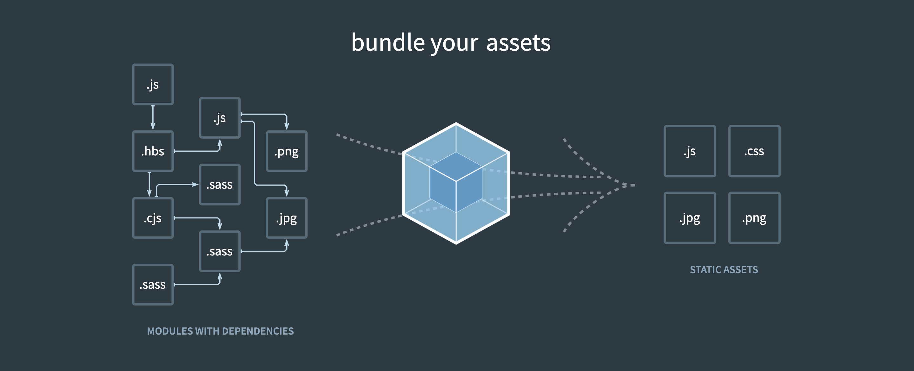

webpack 是一个前端资源加载/打包工具,它根据模块的依赖进行静态分析,然后将这些模块按照特地的规则生成对应的静态资源。依靠插件和 loader 机制，它能做的远不于此

链接： [代码示例地址](https://github.com/hec9527/webpackDev/tree/blog-demo/demo-00)

<!-- truncate -->

## 前言

现代的前端项目基本上都会使用类似于 webpack 这样的打包工具来打包代码，作为一个合格的前端码农，使用 webpack 搭建运行环境是一项基础技能，进阶版的还应该知道 loader 和 plugin 的运行机制和 webpack 的运行分析，这样在今后遇到的性能分析或者打包优化才会有头绪。在开始教程之前你可能需要以下知识背景

- javascript (ES6)
- npm
- typescript(可选)
- shell 常用命令

学完这个教程你能得到什么？

- 能了解 webpack 的基本、进阶配置

- 代码拆分、优化、压缩

- 打包优化

- ...

## 系列文章

- [webpack 入门](/2021/09/08/my-webpack-cli-01)
- [webpack 的四大核心概念](/2021/09/09/my-webpack-cli-02)
- [webpack 开发服务器](/2021/09/10/my-webpack-cli-03)

## 初识 webpack

在使用项目开始之前，我们需要在目录中创建一个 `package.json` 文件，这是一个包描述文件，用于描述作者、简介、包依赖、包构建以及一些其它信息，我们可以手动创建这个文件，也可以使用 npm 命令自动创建，在终端中运行以下代码初始化 npm 包

```bash
npm init -y
```

初始化后的 package.json 大概长这样

```json title="package.json"
{
  "name": "demo-00",
  "version": "1.0.0",
  "description": "",
  "main": "index.js",
  "dependencies": {
    "webpack": "^5.52.0"
  },
  "devDependencies": {},
  "scripts": {
    "test": "echo \"Error: no test specified\" && exit 1"
  },
  "keywords": [],
  "author": "",
  "license": "ISC"
}
```

:::tip
`package.json` 中，`name` 属性通常为中划线小写字母加数字组成，且不能和项目的依赖同名，比如我们要添加 `webpack` 作为项目依赖，那么我们的包就不能使用 `webpack` 这个名字
:::

现在我们使用 `npm` 添加两个 `webpack`，`webpack-cli` 作为我们的项目依赖，安装的时候我们使用 `--save` 参数安装为生产依赖，缩写为 `-S`。使用 `--save-dev` 参数安装为开发依赖，缩写为 `-D`。如果是做普通项目的话，这两个依赖基本没啥区别，如果作为 npm 包或者 node 服务会有不同。

举个栗子：npm 在处理依赖的时候会自动安装依赖的包的依赖，比如我们的包依赖了 webpack，webpack 将 lodash 作为了开发依赖，那么我们在安装 webpack 的时候也会安装 lodash，如果 webpack 将 lodash 作为开发依赖，那么我们在安装 webpack 的时候就不会再安装 lodash

```shell
npm install -D webpack webpack-cli
```

webpack 包是 webpack 的核心，webpack-cli 是 webpack 的命令行工具，使用这个包我们可以在命令行中使用 webpack，而不需要添加配置文件，webpack5 可以实现零配置打包。接下来我们就来体验一下 webpack 的打包过程。

我们在 package.json 的 script 中添加以下内容

```json title="package.json" {3}
"scripts": {
    "test": "echo \"Error: no test specified\" && exit 1",
    "build":"webpack"
},
```

接下来我们在当前目录中创建一个 src 文件，然后在下面创建一个 index.js 文件，并且添加以下内容

```js title="src/index.js"
function show() {
  console.log(1);
}
```

然后在终端中运行以下代码，命令行输出了很多内容，我们不用管，打开生成的`dist/main.js`，查看一下打包内容。 啥？ 竟然是空的，难道 webpack 把我们的代码给删了。webpack 还是的就把我们的代码给删了，webpack5 包含 tree shaking 功能，用于移除 JavaScript 上下文中未引用的代码（dead-code），虽然我们申明了一个 show 函数，但是这个函数并没有调用它，所以 webpack 判断这段代码是 dead-code，就直接给删掉了，删掉这段代码对我们的功能没有任何影响，还可以减少打包产物的大小。

```bash
npm run build
```

现在我们在`src/index.js`中调用 show 函数，然后继续查看`dist/main.js`，现在代码中只有一句 `console.log(1)`，这是也是通过 `tree shaking` 实现的，现在`src/index.js`和`dist/main.js`中的代码是等效的

## 打包模式

接下来我们观察一下命令行的内容，输出中有一个警告，这是因为我们没有指定打包模式，webpack 模式使用了生产模式打包代码。接下来我们就来看一下不同模式下打包的产物有啥区别

```shell
➜  demo-00 git:(blog-demo) ✗ npm run dev

> demo-00@1.0.0 dev /Users/hec9527/code/webpack-dev/demo-00
> webpack

asset main.js 15 bytes [emitted] [minimized] (name: main)
./src/index.js 47 bytes [built] [code generated]

WARNING in configuration
The 'mode' option has not been set, webpack will fallback to 'production' for this value.
Set 'mode' option to 'development' or 'production' to enable defaults for each environment.
You can also set it to 'none' to disable any default behavior. Learn more: https://webpack.js.org/configuration/mode/

webpack 5.52.0 compiled with 1 warning in 193 ms
```

我们修改一下 package.json，在 webpack 启动参数中添加 `--mode development`，这样我们就让 webpack 使用开发模式进行打包。

```json title="package.json" {3}
"scripts": {
    "test": "echo \"Error: no test specified\" && exit 1",
    "build": "webpack --mode development"
},
```

好了，我们再次运行 `npm run build`，现在终端中不会再输出警告信息了

:::tip
这种通过命令行配置 webpack 的方式，是通过 `webpack-cli`这个包实现的，如果我们在使用 webpack 的时候，只安装了 webpack 没有安装 webpack-cli 的话，会提示我们安装的。通过这种方式我们可以完整的配置 webpack，但是将配置全部写在命令行中太长不仅不容易阅读，而且修改起来也很不方便，所以通常都是使用的配置文件的方式来配置 webpack。 如果我们直接运行 webpack， 而不添加配置的话，webpack 是有一个默认配置的，这点后面我们会详细说明。
:::

我们可以尝试在 webpack 启动参数中添加别的参数，比如 `--progress`，这个会显示打包进度，当然我们现在的内容太少了，进度条一闪就没了

```json title="package.json" {3}
"scripts": {
    "test": "echo \"Error: no test specified\" && exit 1",
    "build": "webpack --mode development --progress"
},
```

现在我们再次查看打包产物 `dist/main.js`发现里面多了好多内容，通过这个文件我们可以学习了解 webpack 的工作原理，当然现在还不是时候。如果我们把打包模式设置为 production，打包后的产物就和我们之前的是一样的。

```js title='dist/main.js'
/*
 * ATTENTION: The "eval" devtool has been used (maybe by default in mode: "development").
 * This devtool is neither made for production nor for readable output files.
 * It uses "eval()" calls to create a separate source file in the browser devtools.
 * If you are trying to read the output file, select a different devtool (https://webpack.js.org/configuration/devtool/)
 * or disable the default devtool with "devtool: false".
 * If you are looking for production-ready output files, see mode: "production" (https://webpack.js.org/configuration/mode/).
 */
/******/ (() => {
  // webpackBootstrap
  /******/ var __webpack_modules__ = {
    /***/ './src/index.js':
      /*!**********************!*\
  !*** ./src/index.js ***!
  \**********************/
      /***/ () => {
        eval('function show() {\n  console.log(1);\n}\n\nshow();\n\n\n//# sourceURL=webpack://demo-00/./src/index.js?');

        /***/
      },

    /******/
  };
  /************************************************************************/
  /******/
  /******/ // startup
  /******/ // Load entry module and return exports
  /******/ // This entry module can't be inlined because the eval devtool is used.
  /******/ var __webpack_exports__ = {};
  /******/ __webpack_modules__['./src/index.js']();
  /******/
  /******/
})();
```

好了到目前为止，你已经成为一名入门级《webpack 配置工程师》了，不过这才刚刚开始，我们需要学习的东西还很多
