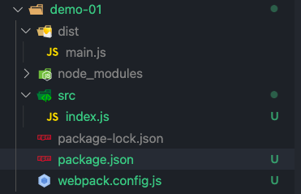

上一篇文章我们提到，使用 webpack-cli 通过命令行参数的方式可以配置 webpack，但是 webpack 配置繁多且复杂，如果我们将所有的配置都通过命令行配置，不仅阅读性差而且修改起来及其不方便同时某些配置也无法实现

链接： [Github 首页](https://github.com/hec9527)

<!-- truncate -->

[实例代码](https://github.com/hec9527/webpackDev/tree/blog-demo/demo-01)

## 系列文章

- [webpack 入门](/2021/09/08/my-webpack-cli-01)
- [webpack 的四大核心概念](/2021/09/09/my-webpack-cli-02)
- [webpack 开发服务器](/2021/09/10/my-webpack-cli-03)

## 如何编写 webpack 配置文件

webpack 配置文件本质上是一个 [commonjs](https://juejin.cn/post/6844903978333896718) 的 js 文件，通常我们会将文件命名为`webpack.config.js`并且存放在项目的根目录，这是 webpack 默认的配置文件路径。接下来我们就简单尝试一下 webpack 的配置文件，创建一个`webpack.config.js`文件，并且添加以下内容。暂时不用管配置文件的内容，稍后我们会详细说明。

```js title="webpack.config.js" {3}
const path = require('path');

/** @type {import("webpack").Configuration} */
module.exports = {
  entry: 'src/index.js',

  output: {
    path: path.resolve(__dirname, './dist'),
  },
};
```

然后修改`package.json`文件

```json title="package.json" {3}
"scripts": {
    "test": "echo \"Error: no test specified\" && exit 1",
    "build": "webpack"
},
```

整体的项目结构大概呈这样，如果编辑器主题支持，`webpack.config.js`文件前面还回有一个图标（我用的 vscode 的`atom one dark`主题就有）。这个时候我们查看一下 `dist/main.js`，仔细观察发现，这个输出文件和上一章我们最后的输出文件是相同的，这说明，我们把配置写在配置文件中和写在命令行中是等效的。



如果我们把 webpack.config.js 这个配置文件放到其它地方，比如`build/webpack.config.js`，那么我们在启动 webpack 的时候是需要指定配置文件的，webpack 启动时默认查找配置文件的路径为`./webpack.config.js`。

```json title="package.json" {3}
"scripts": {
    "test": "echo \"Error: no test specified\" && exit 1",
    "build": "webpack --config ./build/webpack.config.js"
},
```

## webpack 的几个核心概念

现在我们看一下上面的配置文件高亮的第三行，这里使用了 [jsDoc](https://www.shouce.ren/api/view/a/13232) 来对配置文件添加类型申明，这和 typescript 有异曲同工之妙。在编写配置文件的时候，我们就能轻易的知道可以加入哪些字段，以及这些字段的数据类型是什么。下面我们来说说 webpack 的四个核心概念

| 概念           | 说明                                                                                                                                                                  |
| -------------- | --------------------------------------------------------------------------------------------------------------------------------------------------------------------- |
| 入口（entry）  | 打包的入口文件，webpack 会从这个文件开始，分析文件之间的依赖关系并且生成一个依赖关系图，然后将所有用到的代码打包到一个文件当中，入口可以有一个也可以有多个            |
| 输出（output） | 指定 webpack 输出的路径以及输出文件的文件名，文件模块等                                                                                                               |
| loader         | webpack 本只能加载 JavaScript 和 json 文件，如果需要 webpack 处理其它类型的文件并且将他们转为有效的模块以提供应用使用，需要使用 loader 来加载这些文件，如 css、图片等 |
| 插件（plugin） | loader 用于转换某些类型的文件为模块，而插件则拥有更加强大的功能，比如代码优化，资源管理，webpack 配置等                                                               |

`webpack5` 新增了一个属性，也就是我们之前接触到的`mode`，通过它来告诉 `webpack`，我们代码的打包模式，如果为`devlopment`会包含[sourcemap](https://www.ruanyifeng.com/blog/2013/01/javascript_source_map.html)，代码不压缩、支持热更新等功能，如果指定为`production`模式，则会去掉 sourcemap，热更新，代码会使用 `tree sharking` 和压缩，打包后的产物更小，加载速度更快

## 入口（entry）

webpack 的入口可以使一个，也可以是多个，单个入口的配置我们已经体验过了，接下来我们尝试一下多个入口的配置

```js title='build/webpack.config.js' {5,7,11}
const path = require('path');

/** @type {import("webpack").Configuration} */
module.exports = {
  mode: 'production',

  entry: ['./src/index.js', './src/index1.js'],

  output: {
    path: path.resolve(__dirname, '../dist'),
    filename: 'bundle.js',
  },
};
```

上面的配置第五行，我们将模式修改为生产模式，在代码的 11 行，添加了一个输出文件名。在代码的第七行，我们将入口修改为一个数组，并且添加了一个`src/index1.js`文件作为入口，接下来我们就来创建这个文件

```js title="src/index1.js"
function showName(name) {
  console.log(`hello ${name}!`);
}

showName('saga');
```

现在运行 `npm run build`, 查看输出内容

```js title="dist/bundle.js"
console.log(1), console.log('hello saga!');
```

我们指定的`src/index.js`, `src/index1.js`作为入口文件，都打包到了一个文件中。接下来我们尝试一下另外一种，将入口配置为一个对象。

```js title='build/webpack.config.js' {8-9,14}
const path = require('path');

/** @type {import("webpack").Configuration} */
module.exports = {
  mode: 'production',

  entry: {
    main: './src/index.js',
    other: './src/index1.js',
  },

  output: {
    path: path.resolve(__dirname, '../dist'),
    // filename: 'bundle.js',
  },
};
```

我们将入口修改为了一个对象，包含两个属性 main 和 other，并且第 14 行的文件名给注释掉了，这是因为配置多入口的时候，入口的属性名，即 main 就是`src/index.js`打包后输出的文件名，other 就是`src/index1.js`打包后的输出名，如果这时候我们在输出中制定输出文件名的话会出错。你可以取消注释，然后尝试打包一次。删除 dist 文件夹，我们再次编译会得到两个文件`main.js`和`other.js`。以上就是单入口和多入口的配置了，接下来我们说说输出。

## 输出（output）

输出为一个对象，如果要指定输出目录`path`，则需要给定绝对路径，而不是相对路径，通常我们会使用`path.resolve`函数来处理。

```js title='build/webpack.config.js'
output: {
    path: path.resolve(__dirname, '../dist'),
    // filename: 'bundle.js',
    clean: true,
}
```

### 占位符

输出的 filename 中，是可以使用占位符的，占位符的用法为：在字符串中使用中括号括起来的字符串，常见的占位符有：

- hash
- contenthash
- fullhash
- id
- name
- ext
- query
- ...

完整的占位符可以查看这里[webpack 占位符](https://webpack.docschina.org/configuration/output/#template-strings)。虽然 webpack 中占位符特别多，但是实际上常用的就那么几个，比如：

- contenthash 标识内容，可以做缓存，内容不变 contenthash 也不会变
- name 标识文件
- id 标识文件，和 name 效果差不多

hash 系列占位符，替换后是一个长度为 20 的 hash 字符串，可以通过`[contenthash:5]`这种方式来截取前 5 位，这个长度可以自由裁定。上面这些占位符可以在 webpack 中都尝试一下，查看一下输出效果。filename 属性也可以配置路径，下面的案例就将输出的内容存放到了 `dist/js/` 目录下。

```js title='build/webpack.config.js'
const path = require('path');

/** @type {import("webpack").Configuration} */
module.exports = {
  mode: 'production',

  entry: {
    main: './src/index.js',
    other: './src/index1.js',
  },

  output: {
    path: path.resolve(__dirname, '../dist'),
    filename: './js/[name].[id].[contenthash:5].js',
  },
};
```

如果上面的案例你尝试了其它的占位符你会发现，输出的目录中有很多的输出文件，包含之前我们每次编译的内容，但是通常我们只需要最后一次的编译结果。每次手动清理输出文件太麻烦了，其实 webpack 是可以自动清理输出目录的，这在之前的版本中通常需要使用插件来实现。在配置文件的 output 中添加 `clean: true`，在每次打包之前 webpack 都会自动清理输出目录。

```js title='build/webpack.config.js' {4}
output: {
    path: path.resolve(__dirname, '../dist'),
    filename: './js/[name].[id].[contenthash:5].js',
    clean: true,
}
```

### 生成文件类型

webpack 可以控制输出文件的模块类型，就是我们常说的 `umd` `amd` `esm` `commonjs` 模块，我们可以在输出中制定模块类型`libraryTarget`，这通常需要搭配`library`来指定模块名，这在有些类型的模块中非常有用比如：amd,umd 等
如果你对不同的模块类型之前的区别不是特别了解，可以查看这篇文章： [不同模块类型的区别](https://juejin.cn/post/6844903978333896718)。
你可以尝试将上面的案例打包成 system, amd, umd, commonjs 模块然后观察他们之间的区别

```js title='build/webpack.config.js'
output: {
    path: path.resolve(__dirname, '../dist'),
    filename: './js/[name].[id].[contenthash:5].js',
    library: 'test',
    libraryTarget: 'amd',
    clean: true,
},
```

### 生成代码运行环境

搭配 babel-loader，通过指定 `output.environment` 可以指定代码运行环境所支持的 ES 特性。

```js
output: {
    path: path.resolve(__dirname, '../dist'),
    filename: './js/[name].[id].[contenthash:5].js',
    environment: {
        arrowFunction: false, // 不自持箭头函数
        bigIntLiteral: false, // 不支持bigInt类型
        const: false,       // 不支持const定义变量
        destructuring: false,  // 不支持解构
        dynamicImport: false,  // 不支持动态引入
        forOf: false,       // 不支持 forof循环
        module: false,    // 不支持es模块语法  import xx from 'xxx'
    },
    clean: true,
}
```

### 公共路径（publicPath）

用于指定输出的静态资源文件的访问路径，通常不用指定，如果需要将静态资源放到 cdn 可以配置一下

```js title='build/webpack.config.js'
const path = require('path');

/** @type {import("webpack").Configuration} */
module.exports = {
  mode: 'production',

  entry: './src/index.js',

  output: {
    path: path.resolve(__dirname, '../dist'),
    publicPath: '/static/assets/',
    filename: './js/[name].[id].[contenthash:5].js',
    clean: true,
  },
};
```

## loader

这里我们来尝试一下 loader，所谓的 loader 就是一个文件加载器，它加载 webpack 不认识的文档类型，然后把它处理成 webpack 支持的文档类型。

接下来我们创建一个`src/add.ts`文件，并且添加以下内容。这是一个使用 ts 编写的求和函数，在 js 的基础上添加了数据类型。如果对 ts 不是很了解也没关系，案例中使用到的 ts 很少，当然如果你了解 ts 那是最好的

```ts title="src/add.ts"
export const add = (a: number, b: number) => a + b;

export default add;
```

然后我们修改一下`src/index.js`文件，并且添加以下内容

```js title="src/index.js"
import add from './add.ts';

console.log(add(1, 2));

console.log(add(2, 3));
```

我们使用 webpack 尝试打包一下代码， 哎呀，报错了，我们看一下报错的内容

```shell
ERROR in ./src/add.ts 1:21
Module parse failed: Unexpected token (1:21)
You may need an appropriate loader to handle this file type, currently no loaders are configured to process this file. See https://webpack.js.org/concepts#loaders
> export const add = (a: number, b: number) => a + b;
|
| export default add;
 @ ./src/index.js 1:0-27 3:12-15 5:12-15

webpack 5.52.0 compiled with 1 error in 243 ms
```

报错是在`add.ts`中的，上面的报错内容告诉我们，我们需要一个合适的 loader 来加载这种类型的文档。我们可以在[npmjs](https://npmjs.com)中使用`typescript loader`搜索我们需要的 loader，但是常用的就那么几个，这里我们可以直接安装 `ts-loader`，如果你真的去搜了，大概率搜到的结果第一个也是这个，下面我们来安装一下这个 loader

```bash
npm install -D ts-loader typescript
```

我们使用 ts-loader 来处理 ts 文件， 安装 typescript 是因为项目需要 tsc 编译器，安装完成后我们需要初始化 typescript 的配置，直接在命令行中执行以下命令

```shell
tsc --init
```

成功创建 ts 的配置文件（tsconfig.json）后，接下来我们修改一下 webpack 配置，注意配置中高亮的部分是我们新增的内容。这里配置了模块的解析规则，rules 是一个数组可以包含多个规则，比如这里使用 test 匹配文件以`.ts`或者`.tsx`结束的话就使用`ts-loader`。这里我们通过 `include` 来指定我们要包含的文件以及路径，使用 `exclude` 来排除部分文件以及文件夹，通过使用 `include` 和 `exclude` 来限制打包时搜索的路径，可以减少打包所用的时间。

```js title='build/webpack.config.js' {9-16}
const path = require('path');

/** @type {import("webpack").Configuration} */
module.exports = {
  mode: 'production',

  entry: './src/index.js',

  module: {
    rules: [
      {
        test: /.tsx?/,
        use: ['ts-loader'],
        include: /src/,
        exclude: /node_modules/,
      },
    ],
  },

  output: {
    path: path.resolve(__dirname, '../dist'),
    publicPath: '/assets/common/',
    filename: './js/[name].[id].[contenthash:5].js',
    clean: true,
  },
};
```

接下来我们再运行打包一次，这下就成功了，查看一下生成的代码，结果好长好多啊，这是因为`tsconfig.json`默认编译的结果为 commonjs 类型的， 我们需要修改一下 `module: esnext`。然后重新再次打包一下。这下和我们之前打包的产物就差不多了

## 插件(plugin)

> 我们已经有了 loader 为什么还需要 plugin 呢？

这是因为 loader 的主要作用是加载并且转化 webpack 不认识的文件，而 loader 本身基本不参与输出或者很少参与输出以及后续的处理，而 plugin 因为可以访问 webpack 的各种钩子(hooks)，从而可以操作完成的打包流程，可以做到很多 loader 做不到的事情。

### webpack.DefinePlugin

webpack.DefinePlugin 这是一个用于在运行时定义变量的插件，通常使用这个插件向代码中注入环境信息，比如是否是开发模式，或者一些其它全局的变量。让我们简单修改一下 webpack 的配置文件，使用 webpack.DefinePlugin 插件来定义全局变量

```js title='build/webpack.config.js' {2,28-32}
const path = require('path');
const webpack = require('webpack');

/** @type {import("webpack").Configuration} */
module.exports = {
  mode: 'production',

  entry: './src/index.js',

  module: {
    rules: [
      {
        test: /.tsx?/,
        use: ['ts-loader'],
        include: /src/,
        exclude: /node_modules/,
      },
    ],
  },

  output: {
    path: path.resolve(__dirname, '../dist'),
    publicPath: '/assets/common/',
    filename: './js/[name].[id].[contenthash:5].js',
    clean: true,
  },

  plugins: [
    new webpack.DefinePlugin({
      env: JSON.stringify('production'),
    }),
  ],
};
```

然后我们在 `index.js` 中添加一行代码

```js
console.log(env);
```

接下来我们再次打包，查看打包产物，发现代码中的`env`被替换成了`production`，这似乎并不是定义了一个名叫`env`的全局变量。这是因为，`webpack.DefinePlugin`插件采用的是字符串替换的方式处理的，将源代码中所有用到 env 这个变量的地方，都替换成 `JSON.stringify('production')`, 为什么我们要用`JSON.stringify`来包裹变量呢？这是因为如果不包裹一次，那么替换后的内容，将没有引号，在 js 中这就不是一个字符串了，而是一个名叫 `production` 的变量。

<!-- prettier-ignore -->
```js
(()=>{"use strict";const o=function(o,n){return o+n};console.log(o(1,2)),console.log(o(2,3)),console.log("production")})();
```

当然我们不是用 `JSON.stringify` 也是可以的，使用引号嵌套也能达到相同的效果

```js title="buld/webpack.config.js"
plugins: [
    new webpack.DefinePlugin({
        env: "'production'",
    }),
],
```

### webpack.ProgressPlugin

接下来我们在尝试一个新的插件，则是一个展示打包进度的插件，在命令行中添加 `--progress` 可以达到相同的效果

```js title="buld/webpack.config.js" {5}
plugins: [
    new webpack.DefinePlugin({
        env: "'production'",
    }),
    new webpack.ProgressPlugin(),
],
```

### html-webpack-plugin

这是一个第三方的插件，需要自己安装后使用，这个插件主要是用于加载/创建 `html` 模板。上面的两个插件是 webpack 自带的，不需要单独安装，安装 webpack 之后，引用 webpack 包就可以实例化这些插件，首先我们先来安装这个插件

```shell
npm i -D html-webpack-plugin
```

接下来我们继续修改我们的配置文件

```js title="buld/webpack.config.js" {24,34}
const path = require('path');
const webpack = require('webpack');
const htmlWebpackPlugin = require('html-webpack-plugin');

/** @type {import("webpack").Configuration} */
module.exports = {
  mode: 'production',

  entry: './src/index.js',

  module: {
    rules: [
      {
        test: /.tsx?/,
        use: ['ts-loader'],
        include: /src/,
        exclude: /node_modules/,
      },
    ],
  },

  output: {
    path: path.resolve(__dirname, '../dist'),
    // publicPath: '/assets/common/',
    filename: './js/[name].[id].[contenthash:5].js',
    clean: true,
  },

  plugins: [
    new webpack.DefinePlugin({
      env: "'production'",
    }),
    new webpack.ProgressPlugin(),
    new htmlWebpackPlugin(),
  ],
};
```

当我们打包代码后，dist 目录中也增加了一个 index.html 文件，我们可以在浏览器中打开这个文件，打开控制台发现打印出了`3`,`5`,`prodcution`，说明我们的代码已经被 html 引用并且执行了，当然这个插件的功能远不止于此。不仅可以自动生成 html 模板，还可以使用现有的模板。我们简单创建一个 html 模板。

```html title="src/index.html"
<!DOCTYPE html>
<html lang="en">
  <head>
    <meta charset="UTF-8" />
    <meta http-equiv="X-UA-Compatible" content="IE=edge" />
    <meta name="viewport" content="width=device-width, initial-scale=1.0" />
    <title>htmlWebpackPluginTest</title>
  </head>
  <body>
    <div id="app"></div>
  </body>
</html>
```

接着修改我们的配置文件

```js {6-9}
plugins: [
    new webpack.DefinePlugin({
        env: "'production'",
    }),
    new webpack.ProgressPlugin(),
    new htmlWebpackPlugin({
        title: 'webpack插件测试',
        template: './src/index.html',
    }),
],
```

我们再次打开生成的 html 文件会发现，文件的内容已经是我们模板的内容了，包含我们添加的 id 为 app 的 div 元素。这在现代的前端框架中很常用，比如：Vue、React

以上就是我们关于插件的尝试了，后面在实际的案例中会继续添加新的插件。通过上面的案例知道如何使用这些插件就已经达到了目的
