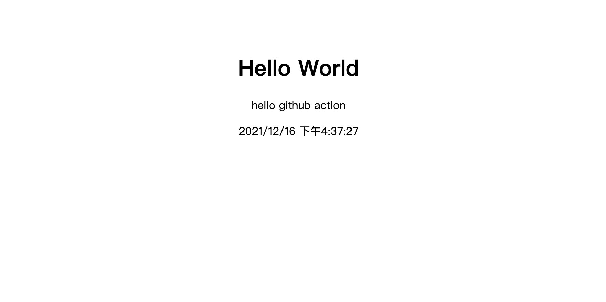

Github Action 是 [Github](https://github.com) 于 2018 年推出的持续集成服务，通过 github 我们可以将持续继承过程中类似于代码拉取、lint 检查、运行测试、构建发布等过程编写成脚本，并且指定触发事件。在手动（定时任务）触发这些指定事件的时候运行脚本，这样将以前需要手动操作的流程变成了自动化处理，极大的节省了开发者的时间

<!-- truncate -->

链接： [Github 首页](https://github.com/hec9527)

## Github Action

Github Action 是 [Github](https://github.com) 于 2018 年推出的持续集成服务，通过 github 我们可以将持续继承过程中类似于代码拉取、lint 检查、运行测试、构建发布等过程编写成脚本，并且指定触发事件。在手动（定时任务）触发这些指定事件的时候运行脚本，这样将以前需要手动操作的流程变成了自动化处理，极大的节省了开发者的时间。

Github 把类似的拉取代码、lint 检查、运行测试等操作称为 action，如果你需要某个 action，也不需要自己从头写一个脚本，github 中托管有大量的第三方 action，使用者可以直接引用别人写好的 action 即可。通常可以在 github 官网提供的市场[Github Action Market](https://github.com/marketplace?type=actions)搜索自己想要的 action，也可以在[awesome-actions](https://github.com/sdras/awesome-actions)仓库查找，这里分门别类的罗列了很多高品质 action。

一个 action 就是一个脚本，通常会放在单独的仓库提供别人引用。使用者可以使用 `userName/repo` 的方式引用 action。比如，`actions/setup-node` 就表示 `https://github.com/actions/setup-node` 这个仓库，它代表一个 action，作用是安装 Node.js。通常 github 官网的 action 都放在 [github/action](https://github.com/actions)里边。

:::info
因为 action 是代码仓库，所以可以使用 git 的指针，比如下面的方式引用都是合法的

```zsh
actions/setup-node@74bc508 # 指向一个 commit
actions/setup-node@v1.0    # 指向一个标签
actions/setup-node@master  # 指向一个分支
```

:::

## 基本概念

- **workflow**： 工作流，一次持续集成的过程就是一个 workflow

- **Job**：任务，一个工作流由多个任务构成， 比如一个工作流包含 `lint检查`, `运行测试`，那么`lint检查`就是一个 job，`运行测试`也是一个 job

- **step**：步骤，一个 Job 由多个步骤组成，指定如何完成一个 job

- **action**： 动作，一个 step 可以依次执行一个或者多个 action

一个 workflow 差不多符合以下树形结构

- workflow
  - lint-job
    - lint-style-action
      - npm run lint:less
      - npm run lint:css
    - lint-script-action
      - npm run lint:jsx
      - npm run lint:tsx
  - test-job
    - unit-test-action
      - npm run test:util

## workflow 文件

github action 的配置文件叫做 workflow 文件，存储在仓库的 `.github/workflows` 目录。

workflow 文件采用 `YAML` 格式，文件名可以随意，一个仓库可以有多个 workflow 文件，github 只要发现一个 workflow 文件就会自动运行该文件。

下面简单介绍一下常见的字段

1. `name`

`name`是当前工作流的名称，可以省略，如果省略该字段默认为 action 文件名

2. `on`

`on`字段用于指定触发 action 的事件，可以是字符串也可以是数组，[全部事件](https://docs.github.com/en/actions/learn-github-actions/events-that-trigger-workflows)

```yaml
on: push
# 或
on: [push, pull_request]
```

指定触发事件时，可以指定分支或者 tag

```yaml
on:
  push:
    branches:
      - master
      - deploy
    release:
      type: [published]
```

3. `job`

`job`字段表示要执行的一个或者多个任务，该字段下的每个字段表示一个 jobId，可以自定义，jobID 里面的 name 字段是该任务的说明，同时可以指定 need 表示该 job 的的前置任务，可以是字符串也可以是一个数组

```yaml
job
    lint_task:
        name: run lint, include stylelint, eslint , etc..
        need: [test_task]
    test_task:
        name: run test, unit test and so on
    publish_task:
        name: build project and publish to serve
        need: [lint_task, test_task]
```

`job`中还有一个必填字段`runs-on`，用于指定 task 运行环境，目前可用的虚拟机只有如下几个，同时使用 ubuntu-latest 即可

- ubuntu-latest，ubuntu-18.04 或 ubuntu-16.04
- windows-latest，windows-2019 或 windows-2016
- macOS-latest 或 macOS-10.14

4. `job.<id>.steps`

`steps`字段用于指定 job 的运行步骤，可以包含一个或者多个步骤，每个步骤可以指定以下三个字段

- name: step 的名称
- run: 该步骤运行的命令或者 action，这里可以引用其它的 action
- env: 指定的环境变量

下面附上一个简单的 workflow 范例

```yaml title='.github/workflows/随便是啥名字.yaml'
name: workflow demo

on:
  push: pull_request

jobs:
  lint_task:
    name: run lint before merge pull request
    runs-on: ubuntu-latest
    steps:
      name: run npm lint script
      env:
        NODE_ENV: ci
      run: npm run lint --if-present
      # --if-present 用于兼容项目中没有指定lint脚本的情况
```

## 准备项目

简单准备一个前端项目，如果没有合适的测试项目可以直接 fork[这个项目](https://github.com/hec9527/github-action)，项目包含一个 npm 脚本`build`，执行 `npm run build` 的时候，会调用 webpack 打包项目生成到 dist 目录。

```md
github-action
├─ .gitignore
├─ package-lock.json
├─ package.json
├─ readme.md
├─ src
│ └─ index.js
└─ webpack.config.js
```

:::info
如果按照博客中的方式使用 github action 存在问题，可以直接 fork [demo 仓库](https://github.com/hec9527/github-action) 修改自己的 secrets，然后 push 一个 commit 即可
:::

简单展示一下项目中部分文件的内容

```js title='src/index.js'
document.title = 'Github Action Test';

document.body.innerHTML = `
<center style="margin-top:80px">
    <h1>Hello World</h1>
    <p>hello github action</p>
    <p class="time" />
</center>`;

const el = document.querySelector('.time');

setInterval(() => {
  el.innerHTML = new Date().toLocaleString();
}, 1000);
```

```js title="webpack.config.js"
const HtmlWebpackPlugin = require('html-webpack-plugin');
const path = require('path');

/** @type {import("webpack").Configuration} */
const config = {
  mode: 'production',
  entry: '/src/index.js',
  output: {
    clean: true,
    path: path.resolve('dist'),
    filename: '[name]-[contenthash:6].js',
  },
  plugins: [new HtmlWebpackPlugin()],
};
module.exports = config;
```

```json title="package.json"
{
  "name": "github-action",
  "version": "1.0.0",
  "description": "用于测试github-action持续集成功能的仓库",
  "scripts": {
    "build": "webpack"
  },
  "keywords": ["github-action", "github", "fontend", "yaml"],
  "author": "hec9527",
  "license": "MIT",
  "homepage": "https://github.com/hec9527/github-action",
  "dependencies": {
    "html-webpack-plugin": "^5.5.0",
    "webpack": "^5.65.0",
    "webpack-cli": "^4.9.1"
  }
}
```

## 创建工作流

此时我们仓库中还没有 `github` 的 `workflow` 文件，我们可以自己手动创建，也可以在 github 自动创建，这里可以直接选择 `nodejs` `workflow`


创建`nodejs`的工作流差不多是下面这样的，不过当前的工作流中还没有发布的流程，我们可以手动添加上

```yaml
# This workflow will do a clean install of node dependencies, cache/restore them, build the source code and run tests across different versions of node
# For more information see: https://help.github.com/actions/language-and-framework-guides/using-nodejs-with-github-actions

name: Node.js CI

on:
  push:
    branches: [master]
  pull_request:
    branches: [master]

jobs:
  build:
    runs-on: ubuntu-latest

    strategy:
      matrix:
        node-version: [12.x, 14.x, 16.x]
        # See supported Node.js release schedule at https://nodejs.org/en/about/releases/

    steps:
      - uses: actions/checkout@v2
      - name: Use Node.js ${{ matrix.node-version }}
        uses: actions/setup-node@v2
        with:
          node-version: ${{ matrix.node-version }}
          cache: 'npm'
      - run: npm ci
      - run: npm run build --if-present
      - run: npm test
```

我们删掉最后一行 `npm run test`，然后添加以下内容

```yaml
- name: Deploy to Server
  uses: easingthemes/ssh-deploy@v2
  env:
    SSH_PRIVATE_KEY: ${{ secrets.SERVER_SSH_KEY }}
    SOURCE: 'dist/'
    REMOTE_HOST: ${{ secrets.REMOTE_HOST }}
    REMOTE_USER: ${{ secrets.REMOTE_USER }}
    TARGET: ${{ secrets.REMOTE_TARGET }}
```

这里我们添加了一个新的字段 `uses`，用于引用其它的 action，同时添加了一些新的东西 `secrets`。这里我们可以先点击右侧的 commit 按钮创建一个提交在项目中添加 workflow 文件。添加后打开仓库的 action 视图，github 正在运行我们刚刚创建的工作流，当然结果肯定会失败，因为我们没有配置发布的服务器信息

:::info
secrets 是 github 提供的用来加密敏感信息的一个工具， 可以在 workflow 中使用，使用 secrets 可以引用来自仓库、仓库环境变量、组织等创建的 secrets。

这里我们需要使用 ssh 发布打包后的代码到指定服务器，所以需要填写服务器的 IP、用户名、`密码/SSH Key`、发布路径等，如果这些直接公布在 workflow 中，任何人都能看到，就能使用我们公布的`SSH KEY`进入我们的服务器，而在 workflow 中通过 secrets 变量引用这些敏感信息就不用担心这些问题

secrets 的命名必须满足以下规则：

- 采用大小写字母、数字和下划线组成
- 不能使用`GITHUB_`前缀开头
- 不能以数字开头
- 不区分大小写
- secrets 在所属的分级（个人、组织、仓库）上是唯一的

:::

## 创建 secrets

在仓库设置页面，点击左侧菜单栏的 Secrets，然后再点击右侧箭头指示位置创建新的 secrets


上面的 workflow 文件中引用了一些变量，比如`secrets.REMOTE_USER`, 这里我们只需要创建一个 Name 为`REMOTE_USER`，Value 为你服务器用户名即可。

这里有几个 secrets 需要创建

- `SERVER_SSH_KEY` 服务器的私钥
- `REMOTE_HOST` 服务器地址(ip/域名)
- `REMOTE_USER` 拥有对应权限的服务器用户
- `REMOTE_TARGET` 发布到服务器指定位置（需要提前创建）

:::warning

需要特别注意的是，这里的 `SERVER_SSH_KEY`，是你的私钥而不是公钥，在 `easingthemes/ssh-deploy` 仓库的 readme 中有说明，但是 issues 里面有很多人反馈秘钥无效的问题。 公钥就是 `cat ~/.ssh/id_rsa`的内容

:::

创建完成 secrets 后，回到项目 action 视图，选择点击刚刚发布失败的日志，右上角有一个 `Re-run all jobs`，点击后重新运行工作流。


待工作流运行完成后，我们启动服务器的静态资源托管服务即可查看我们项目的页面了


