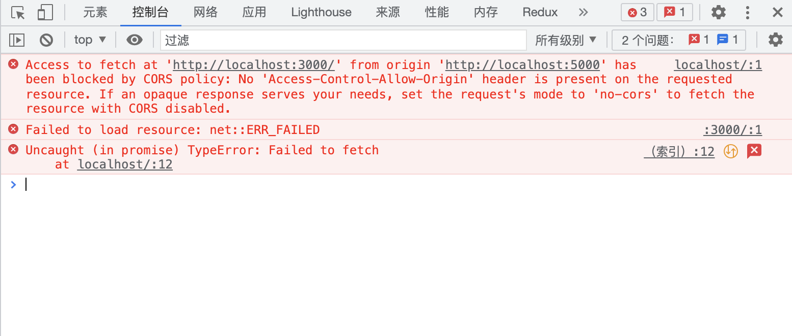
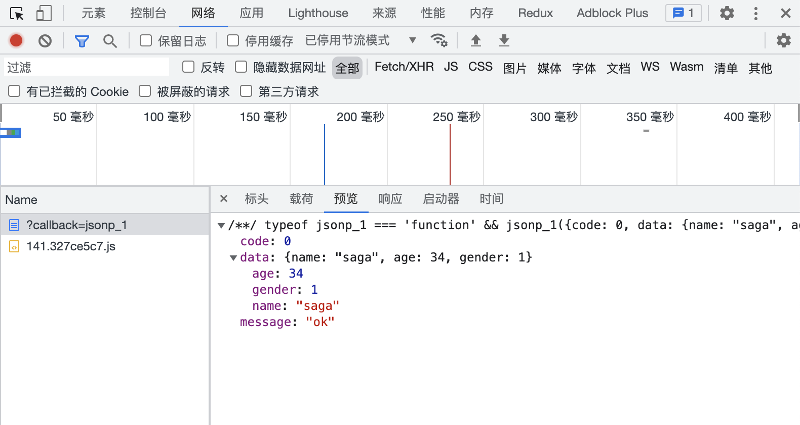
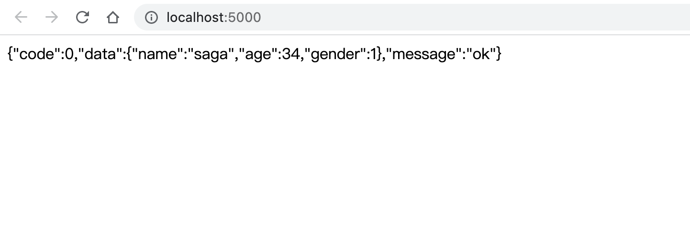
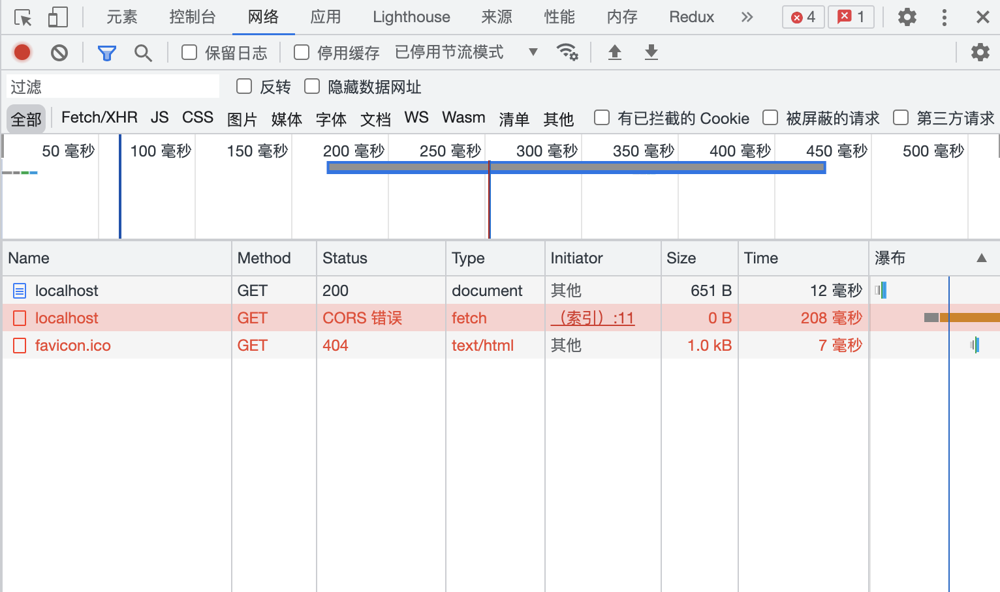
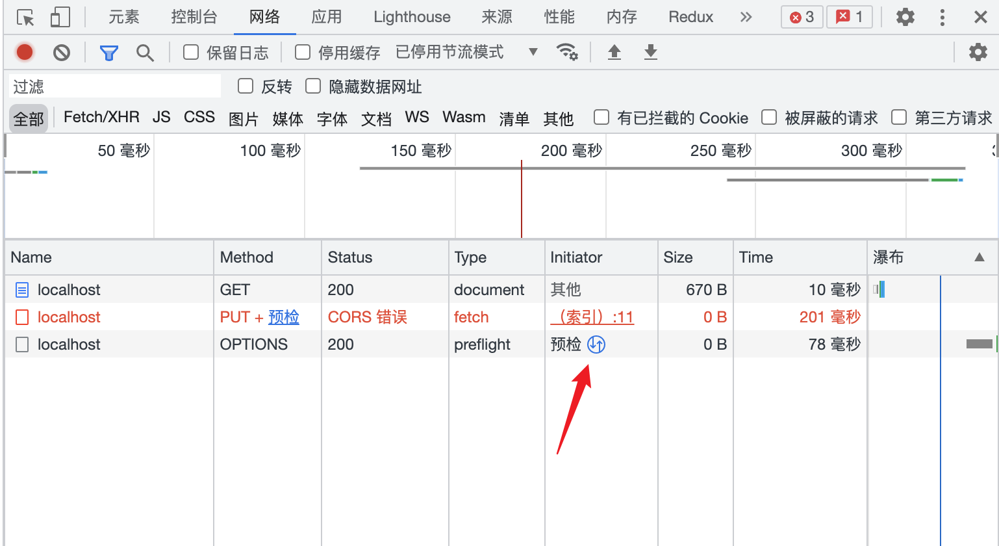
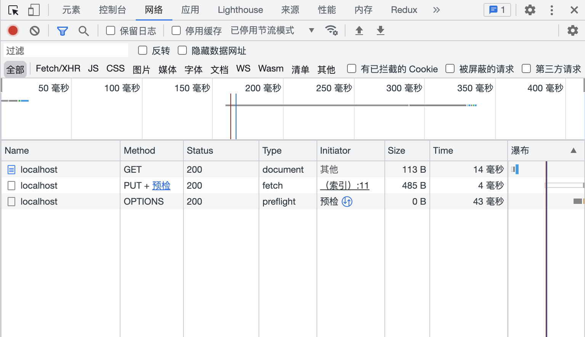

跨域就像牛皮鲜一样粘在每一个前端工程师身上，可以说没遇到或者没解决过跨域的前端工程师，不是真正的前端工程师。不论在工作中还是在面试中，总会遇到或者被问到跨域的问题，所以无论是出于解决问题还是应付面试，理解并且解决跨域都是每个前端工程师的必修课，那么什么是跨域呢？又该如何解决跨域的问题？

<!-- truncate -->

## 什么是跨域

在知道什么是跨域之前，需要先知道什么是同源策略，我们看看 `MDN` 的定义

> **同源策略**是一个重要的安全策略，它用于限制一个 origin 的文档或者它加载的脚本如何能与另一个源的资源进行交互。它能帮助阻隔恶意文档，减少可能被攻击的媒介。

那么同源的定义是什么，同样根据 `MDN` 的定义。

> 如果两个 URL 的 protocol、port 和 host 都相同的话，则这两个 URL 是同源

举个例子，下面这两个 URL 就是同源的，因为他们的`协议`、`主机`、`端口`(https 默认使用 443 端口)都是相同的

```zsh
https://hec9527.top/search/
https://hec9527.top/archive/
```

下面这两个 url 就不是同源的，因为他们的协议不一样。

```zsh
https://hec9527.top/search/
http://hec9527.top/archive/
```

总之 协议、主机、端口三者缺一不可，必须全部相同，才符合同源策略。否则属于跨域，会被浏览器同源策略给禁止。

根据 MDN 对同源策略的定义，同源策略是为了解决非同源资源交互存在的安全风险。举个栗子 🌰

我们用浏览器登录了淘宝，然后再访问了其它网站 A，如果没有同源策略的话，A 网站包含的恶意脚本可能会获取你在登录淘宝后的 token，然后使用这个 token 冒充你在淘宝进行操作，存在安全风险，同源策略的出现，就确保了一个源下的资源只能操作自己的内容。

## 如何解决跨域问题呢

常用的解决跨域的方式有下面四种，接下来我会一一介绍这四种方式以及他们的优缺点

- JSONP
- CORS（跨域资源访问）
- 前端代理
- 反向代理

### JSONP

首先什么是 JSONP 呢？

> 浏览器端通过 script 标签的 src 属性，请求服务器上的数据，同时，服务器返回一个函数的调用。这种请求数据的方式叫做 JSONP

为什么 script 标签可以，其它标签比如`<a/>`标签可不可以呢。说到这里我们需要知道 src 和 href 这两个属性的区别，看下面这几个案例:

- 引用 css 文件：`href="index.css"`
- 引用 js 文件：`src="index.js"`
- 引用图片：`src="banner.jpg"`
- 网站链接：`href="http://hec9527.top"`

上面的案例总结一句话就是：**src 用于代替这个元素，而 href 则用于这个标签和外部资源之间的关联**

像 `img` `video` `iframe` 等都是替换元素，为啥只能是 `script` 标签呢，这是因为这些元素虽然可以引用跨域资源，但是他们不能直接和当前域的资源建立联系，而 script 标签中的脚本加载完成后会自动执行，依靠这个特性可以将请求来的数据插入到当前域的上下文

我们先使用 `express-generator` 搭建一个 `express` 后端服务，作为我们测试跨域的服务器，

```zsh
# 生成服务端代码
npx express-generator server
# 安装依赖
cd server && npm i
# 启动服务  默认：3000端口
npm run start
```

我们简单修改一下后端的路由，返回一个常见的 json 数据，然后重启 express 服务，在浏览器中访问 `http://localhost:3000`，就能看到 express 服务返回的数据了

```js title="server/routes/index.js"
router.get('/', function (req, res, next) {
  var data = {
    code: 0,
    data: {
      name: 'saga',
      age: 34,
      gender: 1,
    },
    message: 'ok',
  };
  res.send(data);
});
```

此时我们新建一个`index.html`文件，在这个文件中添加以下脚本

```html
<script>
  fetch('http://localhost:3000');
</script>
```

然后使用 `node` 工具 [serve](https://www.npmjs.com/package/serve) 启动一个静态资源服务，在这个服务中打开刚刚的`index.html`文件。serve 服务默认监听 5000 端口，之前的 express 服务监听的 3000 端口，这两个端口不一样，我们访问的时候就会遇到跨域的问题，此时在浏览器控制台就会看到以下报错信息



我们简单修改一下服务端路由，让后端返回 jsonp 数据

```js title="server/routes/index.js" {11,12}
router.get('/', function (req, res, next) {
  var data = {
    code: 0,
    data: {
      name: 'saga',
      age: 34,
      gender: 1,
    },
    message: 'ok',
  };
  // res.send(data);
  res.jsonp(data);
});
```

`res.jsonp` 会读取请求中的 `callback` 参数，并且使用该参数作为回调函数的名称。此时我们在浏览器中直接访问`http://localhost:3000/?callback=jsonp_1`然后查看控制台网络请求，就可以看到服务端以 JSONP 形式返回的数据了。但直接在浏览器中访问并没有和项目结合起来。



回到我们之前的`index.html`，我们需要在这个文件中执行跨域请求并且将返回的数据写在页面上。在 `html` 文件中我们添加以下简单的 jsonp 实现

```js title="jsonp.js"
var count = 0;
var timeout = 60 * 1000;

function jsonP(url, params, success, error) {
  var target = document.getElementsByTagName('script')[0] || document.head;
  var script = document.createElement('script');
  var callback = 'jsonp_' + count++;
  var timer;

  timer = setTimeout(() => clean(), timeout);
  params.callback = callback;

  window[callback] = function (data) {
    success && success(data);
    clean();
  };

  function clean() {
    timer && clearTimeout(timer);
    script.parentNode && script.parentNode.removeChild(script);
  }

  script.src = formateUrl(url, params);
  target.parentNode.insertBefore(script, target);
  return clean();
}

function formateUrl(url = '', params = {}) {
  var urlFragments = [];
  for (key in params) {
    urlFragments.push(`${key}=${params[key]}`);
  }
  var _url = url + (url.indexOf('?') === -1 ? '?' : '&');
  return _url + urlFragments.join('&');
}
```

然后再删掉之前的 fetch 请求代码，添加以下代码

```js
// fetch('http://localhost:3000');
jsonP('http://localhost:3000', {}, function (data) {
  document.body.innerHTML = JSON.stringify(data);
});
```

刷新一下浏览器就可以在页面中看到从`localhost:3000`请求回来的数据了



:::info

**总结：** JSONP 的实现原理就是利用 script 元素可以跨域请求资源，通过动态插入 script 标签，资源加载到本地后会立即执行的特性完成数据交互

优点：

- 兼容性好，支持老式浏览器

缺点：

- 非正式传输协议，只支持 GET 请求，不支持 post、put 等其它 http 请求（本质上 script 加载资源就是 GET）
- 客户端和服务端需要定制化开发，服务端返回的数据不是标准的 JSON 数据，而是 callback 包裹后的数据

:::

### CORS（跨域资源访问）

首先我们来看看 MDN 关于 CORS 的定义

> CORS （Cross-Origin Resource Sharing，跨域资源共享）是一个系统，它由一系列传输的 HTTP 头组成，这些 HTTP 头决定浏览器是否阻止前端 JavaScript 代码获取跨域请求的响应。
>
> 同源安全策略 默认阻止“跨域”获取资源。但是 CORS 给了 web 服务器这样的权限，即服务器可以选择，允许跨域请求访问到它们的资源。

CORS 需要浏览器和服务器同时支持，目前 IE10+都支持，整个 CORS 过程都是浏览器自动完成的，前端开发者使用 CORS 通信和同源 AJAX 通信没有差别，所以实现 CORS 通信的关键是服务器，只要服务器实现了 CORS 对应接口响应就可以实现跨源通信。

#### 简单请求和非简单请求

CORS 请求分为简单请求和非简单请求，只要满足以下两个条件就是简单请求，简单请求是为了兼容 form 表单，form 表单的 action 一直都可以实现跨域请求。对于简单请求，浏览器会直接发起 Ajax 请求，并且在请求中添加 Origin 字段用来表示请求是从哪个源发起的

1. 请求方法是以下三种之一

- GET
- POST
- HEAD

2. HTTP 的 head 只能包含以下几个字段

- Accept
- Accept-Language
- Content-Language
- Content-Type (值只限：`application/x-www-form-urlencoded`、`multipart/form-data`、`text/plain`)
- Last-Event-ID

我们新创建一个 `index.html`文件，同样使用 serve 启动静态资源服务。在 html 文档中添加以下内容

```html
<script>
  fetch('http://localhost:3000');
</script>
```

打开浏览器 devtool 的网络面板，可以看到浏览器只发起了一个 ajax 请求，这个请求出现了一个 CORS 错误，这个错误暂时不用管，后面会处理



#### 非简单请求

除了`简单请求`就是`非简单请求`，非简单请求在发起真实请求之前会先发送一个 `OPTIONS` 请求，称之为预检请求，预检请求的作用是为了询问服务器当前网页所在域名是否在服务器的许可名单中，以及可以使用哪些 HTTP 请求类型和请求头字段，只有得到服务器肯定的答复之后才会发起正式的 Ajax 请求，否则会报错

我们修改一下`index.html`中的脚本，在 `fetch` 中使用 `put`请求方式，`put`不属于简单请求的 http 请求类型，所以一定会触发预检请求

```html
<script>
  // fetch('http://localhost:3000');
  fetch('http://localhost:3000', { method: 'put', headers: { 'X-code-by': 'hec' } });
</script>
```

> tips: 点击每个预检请求红色箭头所指示的地方，可以找到对应的真实请求

#### 请求头字段

点开 OPTIONS 请求，可以看到请求头里面包含两个特殊字段：`Access-Control-Request-Method: PUT`, `Access-Control-Request-Headers: x-code-by`，同时还包含一个字段 `Origin`，这些字段不需要开发者手动添加，当浏览器发起跨源请求的时候会自动添加

- `Origin`

  发起请求的源，该字段为浏览器自动添加，并且拒绝开发者修改

- `Access-Control-Request-Method`：

  该字段是必须的，用来列出浏览器的 CORS 请求会用到哪些 HTTP 方法

- `Access-Control-Request-Headers`：

  该字段是可选的一个逗号分隔的字符串，用于指定浏览器 CORS 请求会额外发送的请求头信息



说了一大堆，CORS 还是报错，还是没有拿到跨域资源。诶，别着急，我们这就说说怎么解决跨域的问题，首选在 express 服务的最外层添加一个中间件（至少在路由之前），中间件中设置一堆`Access-Control-xxx`响应头

```js title="server/app.js"
app.use(function (req, res, next) {
  res.header('Access-Control-Allow-Origin', '*');
  res.header('Access-Control-Allow-Methods', 'GET, POST, HEAD, PUT, DELETE, OPTIONS');
  res.header('Access-Control-Allow-Headers', 'Origin, X-Requested-With, Content-Type, x-code-by');
  if (req.method === 'OPTIONS') {
    res.status(200).end();
  } else {
    next();
  }
});
```

这里我们个响应头设置了几个字段，如果为`OPTIONS`请求，则直接设置状态码 200 并且结束请求。需要注意的是，这里响应的状态码，必须是`2xx`，如果响应状态码非`2xx`，依然会出现跨域问题。然后修改一下路由，因为之前的路由只能处理 `GET` 请求，现在我们修改为 `all`，处理所有类型请求

```js title="server/routes/index.js" {1}
router.all('/', function (req, res) {
  var data = {
    code: 0,
    data: {
      name: 'saga',
      age: 34,
      gender: 1,
    },
    message: 'ok',
  };
  res.send(data);
});
```

刷新浏览器，再次查看 devtool，可以看到预检请求和正式请求返回都是 200，成功拿到后端跨源数据。



#### 响应头字段

我们又遇到几个新的 HTTP 头字段，这里罗列一下所有跨源访问响应头的字段以及具体的使用说明：

- `Access-Control-Allow-Origin`

  指定了允许访问该资源的外域 URI，对于不需要携带身份凭证的请求，服务器可以指定该字段的值为通配符，表示允许来自所有域的请求，如果服务器需要使用 cookie，则需要指定具体的域名。**注意：当发出跨源请求时，第三方 cookie 策略仍将适用。**

- `Access-Control-Allow-Methods`

  用于预检请求的响应，其指明了实际请求所允许使用的 HTTP 方法，多个方法用逗号隔开

- `Access-Control-Allow-Headers`

  用于预检请求的响应，其指明了实际请求中允许携带的 http 头字段，多个头字段用逗号隔开

- `Access-Control-Expose-Headers`

  在跨源访问时，XMLHttpRequest 对象的 getResponseHeader() 方法只能拿到一些最基本的响应头，Cache-Control、Content-Language、Content-Type、Expires、Last-Modified、Pragma，如果要访问其他头，需要服务器设置本响应头

- `Access-Control-Max-Age`

  指定了预检请求的结果能够被缓存多久，即：在多久之内发送非简单跨源请求时，不用发送预检请求，单位秒。如果值为-1，表示禁用缓存，每个请求都必须发送预检请求。`Chromium`默认为 5 秒，`v76`之前最大可以设置 600 秒（10 分钟），`V76`之后最大可以设置 7200 秒（2 小时），Firefox 中最大可以设置 86400 秒（24 小时）

- `Access-Control-Allow-Credentials`

  指定了当浏览器的 credentials 设置为 true 时是否允许浏览器读取 response 的内容

:::warning
如果项目中同时设置了 JSONP 和 CORS，为了防止冲突，必须在配置 CORS 中间件之前声明 JSONP 的接口
否则 JSONP 接口会被处理成开启了 CORS 的接口
:::

:::info
**总结：** CORS 需要后端支持，前端开发者不需要做任何修改

优点：

- CORS 支持所有的请求类型

缺点：

- 低版本浏览器不支持，`<IE10`

相关请求头：

- `Origin`
- `Access-Control-Request-Method`：
- `Access-Control-Request-Headers`：

相关响应头：

- `Access-Control-Allow-Origin`
- `Access-Control-Allow-Methods`
- `Access-Control-Allow-Headers`
- `Access-Control-Expose-Headers`
- `Access-Control-Max-Age`
- `Access-Control-Allow-Credentials`

:::

### 前端代理

### 反响代理（后端代理）
