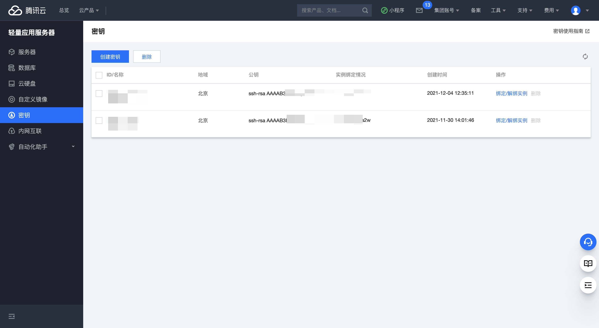
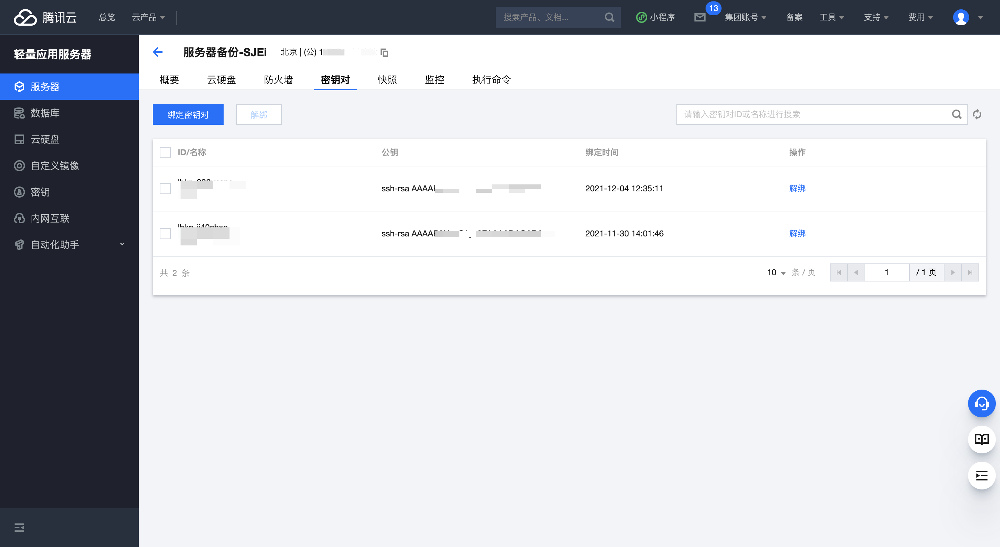
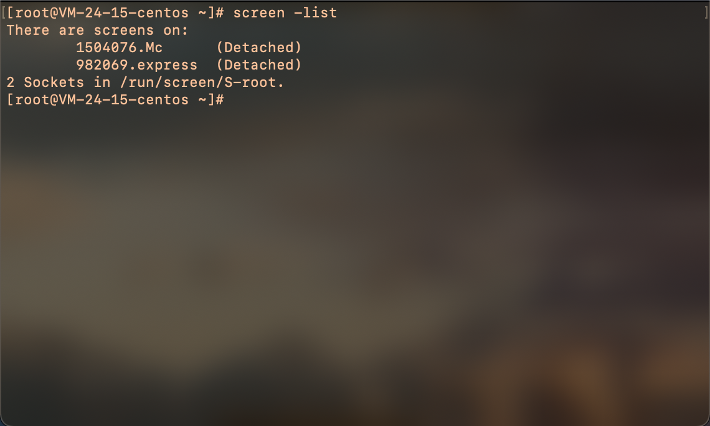

我的世界是一个集合创造、冒险、探索、养成类的沙盒游戏，可以看做现代元宇宙链游的基础版。通过添加第三方的 mod 以及贴图素材，给这款游戏添加可玩性和趣味性，但是盗版玩家却一直为联机这事头疼，因为服务器基本都有正版验证，盗版玩家无法加入游戏，所以大多玩家都依靠第三方对战平台进行联机

<!-- truncate -->

:::info

<center>

#### 健康游戏忠告

抵制不良游戏，拒绝盗版游戏。<br/>
注意自我保护，谨防受骗上当。<br/>
适度游戏益脑，沉迷游戏伤身。<br/>
合理安排时间，享受健康生活。<br/>

</center>

:::

以前尝试过局域网直接连，优点非常明显，延迟低，延迟低，延迟低。但是缺点也很明显，只能在局域网中加入游戏，如果和小伙伴不在同一个局域网就没办法加入了。当然也可以采用第三方平台联机，基本都是某玩家 A 创建世界，同时在局域网开放端口，然后通过对战平台让其它玩家加入游戏，但是这样同样有几个问题：

1. 玩家 A 必须随时在线，否则其它玩家无法进行游戏
2. 玩家 A 的网络或者电脑卡顿，则所有玩家都受到影响
3. 对平台强依赖，如果平台存在网络波动，或者某天 GG 了，就玩不了了

思前想后，还是自己搭建一个 Mc 服务器最好，服务器托管在云端，7\*24 小时可用，不在局限与某个玩家在线，下面我们就来尝试如何搭建 Mc 私服

## 购买腾讯云

[前往活动页，享受超低折扣](https://curl.qcloud.com/JT8CqTgS)

推荐购买 2 核 4G 轻量应用服务器， 8M 下行带宽以及 80G 系统盘，3 年只要 **_￥ 222_**，简直就是白送。

服务器地域选择离自己最近的地区，系统镜像推荐官方系统镜像 `CentOS 8.2`。下单购买后稍等片刻，等服务器初始化完成后前往[轻量应用服务器控制台](https://console.cloud.tencent.com/lighthouse/instance/index)管理镜像

左侧菜单栏有一个秘钥，点击创建，选择已有公钥，然后配置一个秘钥名称以及秘钥，点击确定。 秘钥就是你 `cat ~/.ssh/id_rsa.pub` 输出的内容，window 用户公钥默认存放位置是 `c://user/<userId>/.ssh/id_rsa.pub`



回到轻量应用服务器管理页面，先关机，然后选择菜单 `选择秘钥对`，点击 `绑定秘钥对` 绑定刚刚输入的秘钥，然后就可以直接通过 `ssh root@YOUR SERVER IP` 的方式免密登录了，这个在后面传输文件也非常有用



## 搭建 Java 环境

1. 首先我们登录进入服务器

这里将`[YOUR SERVER IP]`替换为你服务器的 IP 地址，IP 地址可以在轻量应用服务器管理页面左下角“网络信息”里查看，也可以在管理页面顶部查看。

```bash
ssh root@[YOUR SERVER IP]
```

推荐在本地使用别名的方式登录服务器，简单方便快捷，不用记住难记的 IP 地址，后面就可以直接使用 `st` 登录腾讯云服务器了

```bash
# zsh终端存放路径在 ~/.zshrc， bash终端存放在 ~/.bashrc 具体可以百度，下面的IP替换为你的云服务器IP
alias st="ssh root@127.0.0.1"
# 使终端配置生效
source ~/.zshrc
```

2. 安装 Java

我们安装的是 Java 版的 `我的世界`，所以需要 java 作为运行环境，首先检查一下当前系统的 Java 版本，新系统大概率没有 Java

```bash
 java -version
```

使用 `yum` 命令检查可安装的 `java` 版本

```bash
yum search java
# 或则
yum list java*
```

安装

```bash
yum install java-1.8.0-openjdk-devel.x86_64
```

重新执行上面查看 java 版本命令，如果还是找不到 java，则需要修改全局变量

```bash
vim  /etc/profile
```

在配置文件最后添加以下内容

```bash
export JAVA_HOME=/usr/lib/jvm/java-1.8.0-openjdk-1.8.0.171-8.b10.el6_9.x86_64
export CLASSPATH=.:$JAVA_HOME/jre/lib/rt.jar:$JAVA_HOME/lib/dt.jar:$JAVA_HOME/lib/tools.jar
export PATH=$PATH:$JAVA_HOME/bin
```

使全局变量立即生效

```bash
source  /etc/profile
```

再次查看 java 版本，没有的话请另行百度

## 下载 forge

> 说明：以下部分内容可能需要科学上网才能获取，本教程中所包含的资源均可从百度云盘获取 [获取搭建 Mc 服务器资源](https://pan.baidu.com/s/1S8b3xtyxp5FriVOXlZ6OMQ)，提取码: f5ge

[前往 forge 官网](https://files.minecraftforge.net/net/minecraftforge/forge/)

[下载 1.16.5 服务器安装程序](https://maven.minecraftforge.net/net/minecraftforge/forge/1.16.5-36.2.22/forge-1.16.5-36.2.22-installer.jar)

经过多方考虑下载的 `1.16.5` 版本，因为新版本添加的特性并不是很多，但是适配的 mod 却很少，有许多可玩性非常高的 mod 也不支持高版本，所以就下载的`1.16.5`

可以直接在云服务器中直接下载

```bash
wget https://maven.minecraftforge.net/net/minecraftforge/forge/1.16.5-36.2.22/forge-1.16.5-36.2.22-installer.jar
```

也可以在本地下载后上传到云服务器，使用 `FTP` 传文件，或者使用 `scp` 命令（类 Linux 系统），将下面的`<Your Server IP>`替换为你的服务器 IP 地址

```bash
scp path/to/forge-installer root@<Your Server IP>:/root
```

## 安装服务器

执行以下命令会在当前目录创建服务器，推荐单独创建游戏服务器路目录后在目录中执行安装程序。如果在服务器多次安装失败，可以在本地安装服务器，然后将整个服务器所在目录打包上传到云服务器

```bash
# 根据需要
mkdir mc && mv forge-1.16.5-36.2.22-installer.jar mc && cd mc
# 安装服务器
java -jar forge-1.16.5-36.2.22-installer.jar --installServer
```

创建服务器启动脚本

```bash
vim run
```

添加以下内容，`-Xms1000M`表示 Java 虚拟机最小使用内存，`-Xmx3000M`表示 java 虚拟机最大使用内存，可以根据需要和服务器配置灵活调节

```bash
java -Xms1000M -Xmx3000M -jar minecraft_server.1.16.5.jar nogui
```

给服务器启动脚本添加可执行权限，如果失败可使用`sudo`

```bash
chmod +777 run
```

执行 `run` 脚本，第一次运行后会生成一些文件，修改 `eula.txt` 文件，修改 `eula=true`，然后再次运行启动脚本服务器就启动了，这次启动会比较慢，因为会创建地图，当日志显示 Done xxx.xxs 服务器就启动完成了，一般二三十秒。 在终端执行 `/stop` 可以关闭服务器

现在我们需要简单改一下服务器配置 `vim server.properties`，然后重启服务器即可

```bash
# 禁用正版验证，允许盗版玩家进入
online-mode=false
```

## 安装客户端

[前往 HMCL 官网](https://hmcl.huangyuhui.net/)

HMCL 是一个免费、开源的 Minecraft 启动器，允许玩家方便快捷地安装、管理、运行游戏。同时还支持一键安装 Fabric，forge，LiteLoader 等各种 loader 以及各种整合资源包

:::note
HMCL 从创立之处到现在，一直都是用爱发电，你的捐赠，将使 HMCL 越做越好 [前往捐赠](https://afdian.net/@huanghongxun)
:::

安装客户端后选择多人游戏，选择`添加服务器`，服务器名称随便输入(默认也行)，地址输入：`YOUR SERVER IP:25565`，比如你的服务器 IP 地址为 `127.0.0.1`，我的世界服务器监听的是 `25565` 端口（默认），那么完整地址为：`127.0.0.1:25565`，添加完成后点击刷新，可以查看服务器延迟以及其它信息，双击服务器即可加入游戏

## 安装 mod

mod 可以前往 [Mc 百科](https://www.mcmod.cn/class/category/23-1.html) 下载安装，也可以前往 [curseforge](https://www.curseforge.com/minecraft/mc-mods?__cf_chl_jschl_tk__=neMW64HpkcUhI6rOsUB_PKpSal48IGQOOAM7ap69WaE-1641289869-0-gaNycGzNDCU)下载安装（需要科学上网）

部分 mod 需要在服务器和客户端同时安装，部分 mod 只需要在客户端安装，具体情况视 mod 而定。

Mod 安装很简单，服务端只需要在 mc 服务器目录创建一个 mods 目录，然后上传需要在服务器运行的 mod 即可。客户端安装只需要将 mod 存放在游戏目录下的 mods 文件夹中，即在`.minecraft`目录中创建`mods`文件夹，将 mod 放在这个文件夹里面

:::caution
**注意：**无论是客户端还是服务端，添加 mod 后都需要重启才能生效
:::

## 安装 screen

虽然我们的服务器已经安装完成，可以让小伙伴们一起来游戏了，但是我们的终端却不能断开，一旦断开游戏服务器也关闭了，对应的解决办法就是使用 screen，有点类似于守护线程

> `GNU Screen`是一款由 `GNU` 计划开发的用于命令行终端切换的自由软件。用户可以通过该软件同时连接多个本地或远程的命令行会话，并在其间自由切换。只要 screen 本身没有停止，其内部运行的会话都可以恢复，我们可以利用这个特点来保持我们的服务

使用 yum 安装 screen

```bash
yum install screen -y
```

使用 screen 创建会话

```bash
screen -S Mc
```

此时我们会进入一个新的会话，可以在这个会话里面执行一些运行时间很长或者一直运行的程序，按 `ctrl + a d` 退出当前会话（服务继续执行），按 `ctrl + a k` 结束当前会话（退出服务）

恢复会话

```bash
# Mc 是创建回话时指定的名字，也可以用会话id
screen -r Mc
```

列出所有会话

```bash
screen -list
```

下面列出的就是现在保持的会话，会话 id 和会话名称用`.`分割



## 推荐 mod

- [升级版下届合金](https://www.mcmod.cn/class/2886.html)
- [末影合金](https://www.mcmod.cn/class/2878.html)
- [匠魂 3](https://www.mcmod.cn/class/3725.html)
- [幸运方块](https://www.mcmod.cn/class/294.html)
- [珊瑚墓碑](https://www.curseforge.com/minecraft/mc-mods/corail-tombstone/files?__cf_chl_captcha_tk__=KVdSQTsq6qqLrTM3X2il5eJvmCfX5qIrtVGx2IvMWSA-1641297980-0-gaNycGzNDpE)
- [寂静装备](https://www.curseforge.com/minecraft/mc-mods/silent-gear/files)
- [村庄出生点](https://www.curseforge.com/minecraft/mc-mods/village-spawn-point/files)

## FQA

1. 如何安装皮肤

   前往 https://littleskin.cn/ 下载，然后在 HMCL 启动器中配置角色信息，替换皮肤

2. 下载 forge 失败怎么办？

   forge 可以在本地下载，也可以在服务器直接下载，如果多次尝试依然失败，可以尝试前往百度云下载打包好的资源包 [获取搭建 Mc 服务器资源](https://pan.baidu.com/s/1S8b3xtyxp5FriVOXlZ6OMQ)，提取码: f5ge，不仅有各种安装过程中需要的文件，还有打包好的服务器， 接在后即可直接运行
