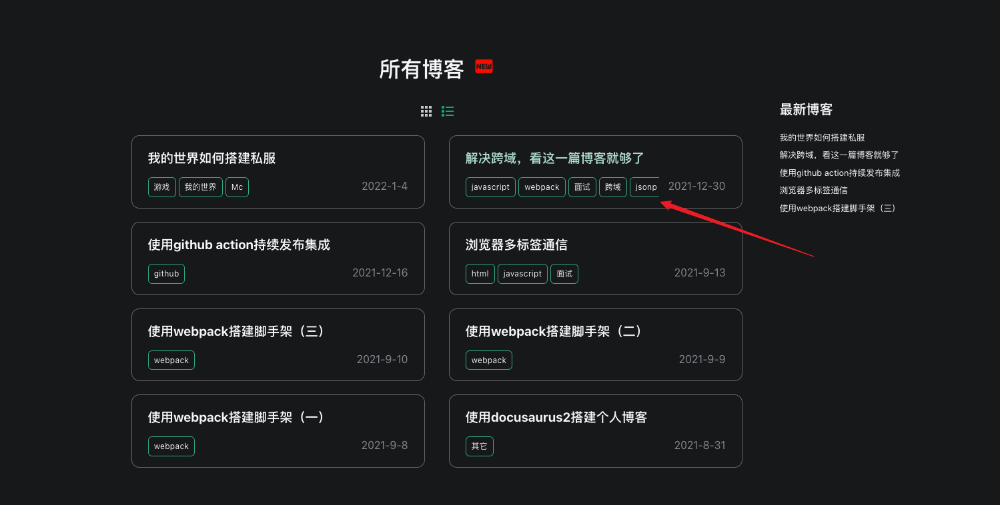
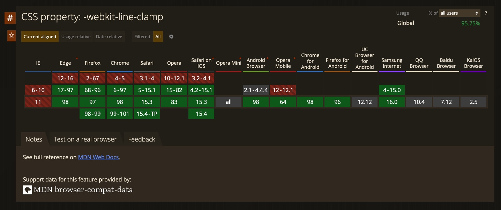

有时候在我们需要展示标签这类的元素时，通常会为将他们设置为 inline-block，同时设置内边距。如果我们希望在超出父级容器时，隐藏这个标签，就有点麻烦了，标签被截取了一部分，这并不是我们想要的效果...

<!-- truncate -->

## 背景

最近在做博客的移动端适配时发现，当屏幕比较小，标签在一行放不下的时候，最后的标签被隐藏了一部分，这看起来太别扭了，有没有一种办法能让超出的标签整个都隐藏呢，答案是有的的



## 单行文本隐藏

在解决问题之前我们先复习一下基本的超出隐藏的知识，在 css 中通过设置 `overflow:hidden` 来设置元素的超出隐藏，对于文本我们需要设置文本的超出隐藏 <a href="/inline-block-overflow/single-line-text.html" target="_blank">单行超出隐藏案例</a>

```css
.text-overflow {
  width: 300px;
  white-space: nowrap;
  overflow: hidden;
  text-overflow: ellipsis;
}
```

## 多行文本超出隐藏

多行文本超出隐藏就是在单行文本的基础上增加了行数的限制，这里需要用到 `-webkit-line-clamp:3` 限制行数，同时去掉禁止换行的限制。根据 [caniuse](https://caniuse.com/?search=-webkit-line-clamp) 的结果来看，`-webkit-line-clamp` 属性整体的兼容性还是不错的



多行文本超出隐藏示例代码

```css
.text-overflow {
  display: -webkit-box;
  width: 300px;
  overflow: hidden;
  text-overflow: ellipsis;
  -webkit-line-clamp: 3;
  -webkit-box-orient: vertical;
}
```

## 文本块如何整体隐藏

回到之前的问题，标签的容器宽度有限，对于超出宽度的标签，我们整体隐藏掉（只展示一半的标签看起来也很奇怪）。我将博客标签整理成了一个简单案例，这里有点类似于单行文本的超出隐藏，我们需要在父容器添加 `overflow: hidden`, 同时因为标签需要有内边距和背景色所以修改定位为 `display: inline-block`。 案例代码 👉🏻 <a href="/inline-block-overflow/tags.html" target="_blank">标签超出隐藏案例</a>

```html
<style>
  .container {
    width: 300px;
    overflow: hidden;
    padding: 4px;
    border: 1px solid #888;
    white-space: nowrap;
  }

  .tags {
    display: inline-block;
    padding: 4px 7px;
    background: #3582d8;
    border-radius: 4px;
    color: #fff;
  }
</style>
<div class="container">
  <div class="tags">webpack</div>
  <div class="tags">JSONP</div>
  <div class="tags">React</div>
  <div class="tags">Vue</div>
  <div class="tags">Rollup</div>
</div>
```

#### 解决方案

这里我们需要在父容器设置 `text-overflow: ellipsis;`，超的标签就会隐藏掉，并且显示 `...`

完整示例代码 👉🏻 <a href="/inline-block-overflow/tags-resolve.html" target="_blank">标签超出整体隐藏案例</a>

---

当晚加班补充：看上去已经完美解决问题了，可是拿起我祖传的 iphone6 一看，我滴个乖乖，咋又掐了一半呢。遇到问题别着急，我们给父元素添加一个 `-webkit-line-clamp: 1;` 就好了


完美解决方案示例代码 👉🏻 <a href="/inline-block-overflow/tags-perfect.html" target="_blank">标签超出整体隐藏案例</a>

```css
.container {
  width: 220px;
  border: 1px solid #888;
  overflow: hidden;
  white-space: normal;
  text-overflow: ellipsis;
  display: -webkit-box;
  -webkit-line-clamp: 1;
  -webkit-box-orient: vertical;
}

.tags {
  display: inline-block;
  padding: 4px 7px;
  background: #3582d8;
  border-radius: 4px;
  color: #fff;
}
```
