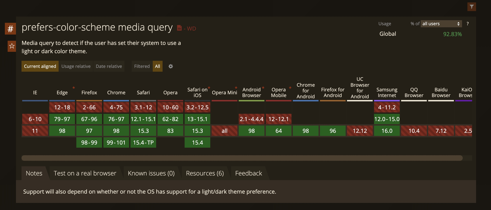
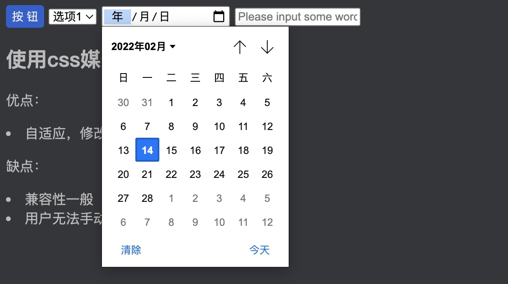
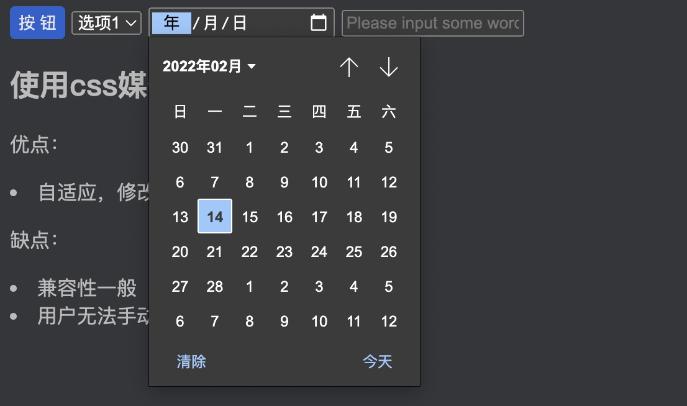

我想应该很多人都遇到过，晚上睡觉收到一条消息，拿起手机解锁瞬间亮瞎狗眼。人眼对光线的适应需要一定的时间，突然的光线变化会让人难以适应，会感到发眩，眼睛睁不开，什么都看不清，要过几秒钟才能恢复正常，这就是光适应现象。对于需要长期面对显示器的人群而言，有一个舒适的显示亮度和光线尤为重要...

<!-- truncate -->

## 背景

在深色主题下，用户可以选择深色的系统外观，在弱光环境下不会太刺眼，正常光线下显示效果也很不错，可以极大的提高用户使用体验

深色主题的优势：

- 可以大幅减少耗电量（取决于设备的屏幕技术）
- 增强弱光环境下阅读体验
- 提高对强光敏感的用户可视性

## 通过 CSS 媒体查询适配



`CSS3` 的媒体查询不仅可以用来查询屏幕尺寸，还可以用来查询当前系统主题色，根据查询到的结果修改对应的样式即可完成深色模式主题适配

`prefers-color-scheme` 可以用来查询当前系统主题色，可查询的值为： `light`、 `dark`、 `no-preference` 对应的值为：`浅色模式`、`深色模式`、`未指定`

```css
/* prettier-ignore */
@media screen and (prefers-color-scheme: light),
       screen and (prefers-color-scheme: no-preference) {
  body {
    background: #fff;
  }
}

@media (prefers-color-scheme: dark) {
  body {
    background: #35363a;
    color: #bbb;
  }
  .button {
    color: #e5e5e5;
    background: #2a5ecf;
  }
}
```

`no-preference`（未指定）可认为是默认模式，通常可以和浅色模式或者深色模式放在一起，如果系统未指定主题色，则采用 `no-preference` 的查询结果，如果系统有指定主题色，则采用对应的匹配结果，系统主题为浅色模式，则采用查询值为 `light` 的结果，如果系统主题为深色模式，则采用查询值为 `dark` 的结果。

上面代码只作为原理演示，不具有指导意义。通常的做法是在根元素(:root)或者 body 上使用 css 变量，在项目其他地方使用这个变量，做深色适配的时候，只需要修改根元素上定义的变量即可修改项目的整体配色，而不用去为每个类重新定义样式

css 媒体查询适配深色模式案例可以参考这个 👉🏻 <a href="/html-dark-mode/css-dark-mode.html" target="_blank">CSS 媒体查询适配深色模式</a>

当你查看上面这个 demo 的时候，你或许会发现，我们自己的组件倒是可以实现深色模式适配了，可是 H5 组件怎么还是浅色的。你看看这下拉框，你看看这日期选择组件，还有这文本输入框，全是白色的，看着就很刺眼



别着急，h5 组件也是支持深色模式适配的，只需要在 `head` 中添加这段代码，然后将系统调整为深色模式即可查看效果了。在修改系统主题色的时候，和 CSS 的媒体查询实现的效果一样，会自动修改 H5 组件的色彩模式

```html
<meta name="color-scheme" content="light dark" />
```

除了在 meta 标签中指定，也可以在 CSS 中指定色彩模式，这里的 `:root` 也可以是 `body` 以及其它任何元素，所选元素及其子元素的表现形式（深色/浅色）会自动根据系统主题自动适配

```css
:root {
  color-scheme: light dark;
}
```



:::info

#### 使用 CSS 媒体查询实现深色模式适配

优点：

- 实现简单，系统自适应，当系统主题色修改后自动更新页面主题

缺点：

- 兼容性一般，实际项目中谨慎使用
- 用户无法手动修改主题色，只能根据系统主题色修改
- 完全依赖 CSS 媒体查询的兼容性，当媒体查询不可用时，无法做适配

:::

随便提一句，在现代前端工程中，首屏加载时间是衡量页面性能的重要指标，可以 `<link>` 标签中按需引入 CSS，不引入无用的 CSS，从而减少数据加载量，减少首屏加载时间。比如下面的代码默认加载通用 CSS 以及浅色主题的 CSS，当系统修改为深色模式时，在加载深色主题 CSS

```html
<link href="./common.css" rel="stylesheet" type="text/css" />
<link href="./light.css" rel="stylesheet" type="text/css" />
<link href="./dark.css" rel="stylesheet" type="text/css" media="(prefers-color-scheme: dark)" />
```

## 使用 JS 适配

### `matchMedia`

采用 css 媒体查询实现深色模式适配的方式实现了应用程序主题自适应，但是用户完全失去了选择权，如果用户需要指定浅色模式或者深色模式，在保留根据系统主题自适应的情况下单纯使用 `CSS 媒体查询` 就无法实现了。为什么在这里我要强调 `CSS 媒体查询` 呢。因为媒体查询不仅可以使用 CSS 实现，还可以使用 JS 实现。在浏览器宿主环境中包含 `matchMedia` API 用于检查媒体查询，返回结果是一个媒体查询列表对象，它包含三个属性

```js
mqList = window.matchMedia(mediaQueryString);
```

- `matches` 当前文档是否匹配该媒体查询列表，匹配为 true 否则 false
- `media` 序列化的媒体查询列表
- `onchange` MDN 文档中不包含该属性，该属性为一个函数，在媒体查询结果改变的时候触发

同时媒体查询列表包含两个方法，用于添加监听回调和删除监听回调，回调函数会在媒体查询结果改变的时候触发。利用这个特性，就可以实现类似于 `CSS 媒体查询` 应用程序自动根据系统主题色适配的效果

- `addListener()`
- `removeListener()`

具体怎么实现呢，通常可以在 css 中定义一些 css 变量，在应用中使用这些变量，媒体查询回调中修改 body 类名修改变量的值，最终实现主题色修改。这个案例中根据媒体查询列表的 `matches` 属性来确定 body 元素上应用的类名

```css
body,
body.theme-light {
  --text-color: #000;
  --background-color: #f5f5f5;
}

body.theme-dark {
  --text-color: #ddd;
  --background-color: #35363a;
}
```

### 实现手动设置主题色

如何才能既保留自动适配系统主题，又基于用户选择的空间呢？

在页面上添加一个复选框，标识是否使用系统主题，然后添加两个单选框，用于切换用户自定义主题，当系统主题复选框勾选的时候忽略用户自定义设置。

<video autoPlay muted loop style={{"width":"100%"}}>
  <source src="/video/h5-深色模式适配.mp4" type="video/mp4" />
</video>

<center>
<small>感谢 <a href="">https://compress-video-online.com/zh/</a> 提供的在线视频压缩工具</small>
</center>

值得注意的是，使用自定义应用主题，不能直接在 `<mete>` 标签中设置 `color-scheme`，这个属性会根据系统主题自动修改 H5 内置组件的主题。直接写在 `<meta>` 标签中，如果当前系统为深色模式，应用为浅色模式，那么 H5 组件会显示成深色模式，会使应用的主题配色会产生割裂感。

在这个案例中，在修改 body 类名的时候同时修改 `<meta>` 标签的色彩模式，修改应用为深色模式的时候同步修改 `<meta>` 的 `content` 属性为 `dark`，修改应用为浅色模式的时候同步修改 `<meta>` 标签的 `content` 属性为 `light`。这样就可以在每次应用主题修改的时候，保证 H5 组件色彩模式和应用一致。

Talk is cheap, show me the code. 👉🏻 <a href='/html-dark-mode/js-dark-mode.html' target="_blank">查看 JS 实现暗色主题适配方式</a>

到这里 JS 适配深色主题似乎就完成了，可是兼容性依然有待提高，在不支持媒体查询的环境中，应用程序无法做到根据系统主题自动修改，已不存在降级方案。实际上可以根据当前系统时间来推断 `深色/浅色` 模式。开启深色模式的时间可以来自于用户输入，也可以是程序默认。通过当前系统时间来判断是否开启深色模式，作为兼容方案，这个方案不能根据当前系统主题实时做出修改。 👉🏻 <a href="/html-dark-mode/time-dark-mode.html" target="_blank">根据时间适配主题</a>

:::info

#### 通过 JS 媒体查询的方式

优点：

- 使用方式灵活，可操作性高
- 可支持用户自定义主题
- 有着不错的降级兼容方法

缺点：

- 使用起来不如 CSS 媒体查询方便快捷

:::

## 图片适配

图片的适配不能像主题一样通过修改 CSS 来实现，通常可以使用 `picture` 元素搭配媒体查询，在不同的主题下加载不同的图片。

```html
<picture>
  <!-- 深色模式下的图片 -->
  <source srcset="dark.png" media="(prefers-color-scheme: dark)" />
  <!-- 默认模式下的图片 -->
  
</picture>
```

有一个比较偷懒的方法， 当然我也是这做的

> 在图片上面盖一个灰色半透明的 div 元素

当然还有一个比较不错的办法，比在图片上盖一个 div 更加优雅的方案，那就是使用 CSS 滤镜，整体兼容性还不错，考虑 IE 的话，还得盖一个半透明 div

```css
img {
  filter: brightness(0.4);
}
```

H5 图片深色模式案例戳这里 👉🏻 <a href="/html-dark-mode/picture-dark-mode.html" target="_blank">图片深色模式案例集合</a>
