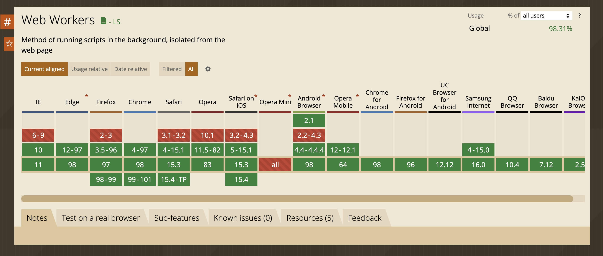
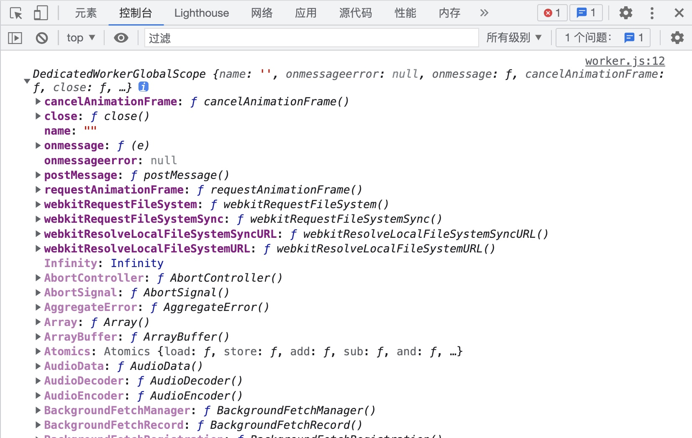
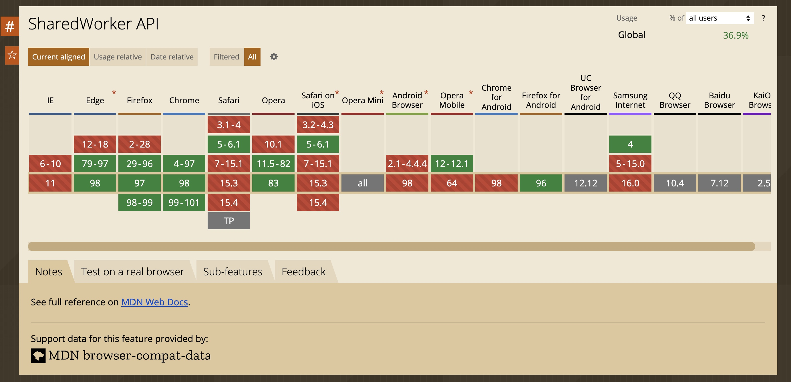
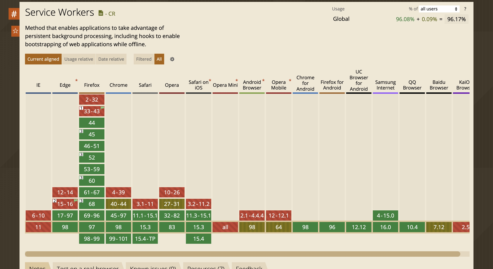

众所周知 JavaScript 是单线程执行的，也就是在同一个时间只能做一件事情，如果遇到执行时间较长的脚本就会导致页面卡顿，无法及时响应用户交互。那么为什么 JavaScript 不能有多个线程呢？怎样才能提高 JavaScript 的执行效率？

答案就是 `Web Worker`

<!-- truncate -->

## 什么是 web worker

web worker 是一个独立运行的 JavaScript 线程，独立于其它脚本环境，不会影响页面性能，这使得 JavaScript 的多线程编程成为可能，通常可以在 web worker 中执行一些比较费时的操作。

一个 worker 就是一个使用构造函数创建的一个对象，运行一个命名的 JavaScript 文件，这个脚本文件将在单独的工作线程中运行。worker 运行在另外一个全局上线文中，不能直接在 worker 中直接访问 window 等属性，也不能直接操作 DOM 节点，但是可以使用很多 window 对象之下的东西，比如 websocket，Math，parseInt，parseFloat 等。

worker 线程和主线程之间的数据传输通过消息机制实现，使用上和之前的 [浏览器多标签通信](/2021/09/13/browser-multiTab-communication) 中的 `postMessage` 用法相同。通过 worker 对象的 `postMessage` 方法发送消息，通过 worker 对象的 `onmessage` 事件可以接收消息。

> 现代浏览器基本都支持 web worker



## 为什么要使用 web worker

worker 运行在独立的线程中，这使得页面主线程可以继续执行交互逻辑、响应用户操作从而避免卡顿。通常可以将一些比较耗时的操作放到 worker 进程中，待 worker 处理完成后将处理的结果发送给主线程。比如这个案例：《使用 box-shadow 绘制图片》就使用到了 web worker，在使用 worker 的情况下可以极大地提高处理效率，同时避免因为主线程执行时间过长，浏览器失去响应

在线案例 👉🏻 <a href="/box-shadow-multi-process/index.html" target="_blank">web worker 多线程版本</a>

## 如何使用

### 在主线程中创建 worker

web worker 是通过 `Worker`函数创建，返回一个 worker 实例，通过这个实例的 `postMessage` 向 worker 发送消息，通过 onmessage 接受 worker 返回的消息，当然也支持 `addEventListener` 来添加事件监听，这两个效果是一样的。

```html title='index.html'
<script>
  const worker = new Worker('./worker.js');

  worker.postMessage({ type: 'showTime' });
  worker.postMessage({ type: 'randomNum' });

  worker.onmessage = function (e) {
    console.log('主线程消息:', e.data);
  };

  worker.addEventListener('message', (e) => {
    console.log('主线程addEventListener', e.data);
  });
</script>
```

在 `worker` 中我们无法访问 `window` 对象，直接在代码中访问 window，会报错 `Uncaught ReferenceError: window is not defined`，取而代之的是使用 `this` 访问全局，在 `worker` 中的全局对象是 `DedicatedWorkerGlobalScope`，从下面截图我们可以看到 `worker` 环境中的全局变量，就是阉割到极致的 `window`



在 `worker.js` 中添加以下代码，然后通过静态资源托管服务器就能看到效果了。什么是静态资源托管服务器？为什么需要它？

> 静态资源服务器可以是一个普通的服务进程，它负责监听端口，接收 HTTP 请求，返回对应的静态资源。这里为什么需要静态资源服务呢，因为 `worker` 受浏览器同源策略限制，只能加载同源的脚本文件，如果直接在浏览器中打开 html 文件走的是 FTP 协议，不是 HTTP 协议，无法加载 worker 脚本

### 在 worker 中添加处理

```js title="worker.js"
onmessage = function (e) {
  console.log('web worker 收到消息:', e.data);
  if (e.data.type === 'showTime') {
    postMessage(`当前时间： ${new Date().toLocaleDateString()}`);
  } else if (e.data.type === 'randomNum') {
    this.postMessage(`随机数： ${Math.random()}`);
  }
};

postMessage('web worker加载就绪');

console.log(this);
```

在线案例 👉🏻 <a href="/web-worker/base/index.html" target="_blank">web worker 基础用法</a>

### 关闭 worker

worker 的关闭可以在主线程进行，主线程可以通过 worker 的 terminal 方法关闭 worker。需要特别注意的是，调用关闭后，worker 会被立即杀死，不会再有任何机会执行脚本。

```js title='index.js'
worker.terminal();
```

在 worker 线程中，worker 也可以自己调用自己的 close 方法关闭

```js title='worker.js'
close();
```

### worker 的其它用法

#### 生成嵌套 worker

在 worker 中是可以创建其它 worker 的，这就是所谓的嵌套 worker，所有的嵌套 worker 必须符合同源策略，嵌套 worker 的解析会相对于父 worker 的解析，方便记录 worker 之间的依赖关系

#### 引入脚本与库

worker 线程中包含一个全局函数，可以用来引入脚本，通过这个方式引入的脚本的全局变量可以被 worker 使用

## 共享 worker(shared worker)

<!-- TODO 共享worker在 window 系统测试 -->

共享 worker 可以被多个脚本使用，即使这些脚本正在被不同 window，iframe 或者是 worker 访问。共享 worker 和普通的专用 worker （通过 `new Worker('scriptPath')` 创建的 worker）相比有以下不同

- 创建方式不同，共享 worker 通过 `SharedWorker` 构造函数来创建
- 通信方式不同，与共享 worker 通信必须通过端口对象进行（在普通的专用 worker 中这是隐式的）

共享 worker 的兼容性非常差，在实际业务中不推荐使用。IE、Safari 以及移动设备基本都不支持



👉🏻 <a href="/web-worker/sharedWorker/1.html" target="_blank">共享 worker 案例</a>

## ServiceWorker

### 简单介绍 Service Worker

service worker 整体兼容性相比共享 worker 要好不少，但是生产环境仍需要谨慎使用



Service Worker 是浏览器在后台独立运行的脚本，它不需要网页和用户交互。现在它已经包含了类如消息推送、后台同步、拦截处理网络请求、管理缓存等功能，未来将会添加更多功能，同时它也支持离线体验。

### 注册 Service Worker

不同于专用 Worker 和共享 Worker 通过构造函数创建，Service Worker 的注册函数挂载在 `navigator.serviceWorker` 下面，为了确保兼容性，通常会在使用前判断，`window.navigator` 对象下面是否存在 `serviceWorker` 对象。

该案例展示了如何在页面中注册一个 Service Worker

```js
if ('serviceWorker' in window.navigator) {
  navigator.serviceWorker.register('./sw.js').then(
    (registration) => {
      console.log('service worker 注册成功', registration);
    },
    (error) => {
      console.log('service worker 注册失败', error);
    },
  );
}
```

### 使用案例

Service Worker 离线访问页面 👉🏻 ： <a href="/web-worker/service-worker1/index.html" target="__blank">查看案例</a>
