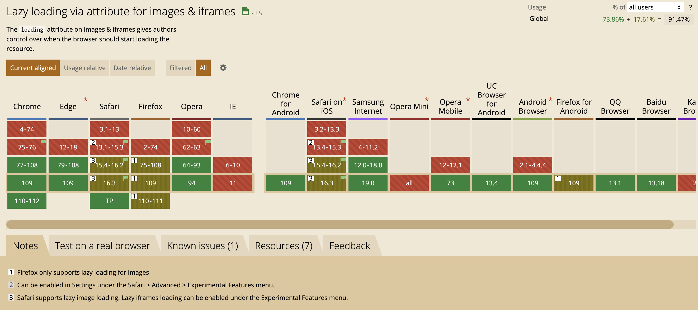
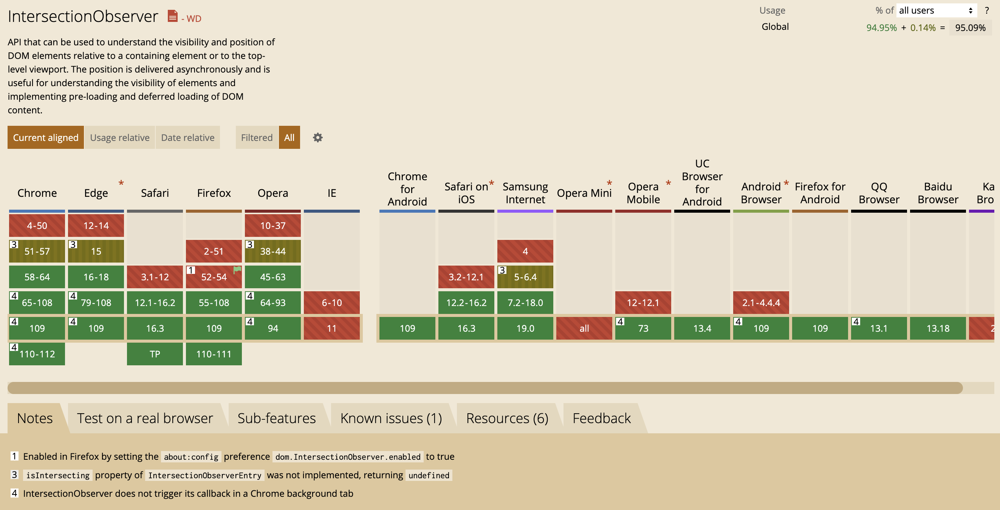

虽然浏览器加载图片、脚本、字体等资源的时候本身就是异步加载的，但是页面上的所有图片默认都是在页面加载的时候就开始请求的，不仅浪费带宽而且会增加页面的首屏加载时间，用户体验较差

<!-- truncate -->

## 浏览器原生懒加载

 👉🏻 <a href="/浏览器原生图片懒加载/index.html" target="_blank">查看懒加载效果</a>

现代浏览器中，``标签原生就支持懒加载，在``标签中添加`loading`属性，其允许的值为`eager|lazy`，默认值为`eager`，浏览器会在页面加载时立即加载图像，不论它是不是在视口范围内。如果设置为`lazy`，值到图片滚动到与视口一定距离才会开始加载图片，这个距离由浏览器来自定


<video width="100%" muted loop autoPlay>
  <source src="/video/原生懒加载.mp4"/>
</video>

根据 `caniuse` 的数据统计，截止目前原生的loading属性支持率由91%，生产环境可能需要polyfill




:::info
如果设置了`loading='lazy'`依然没有延迟加载图片可能是因为以下原因：
  1. 高度不够，图片延迟加载时距离视口的距离这个是由浏览器来控制的，可以增加页面高度，或者多添加点图片，也可以给图片设置一个高度
  2. 没有启用javaScript
:::

## IntersectionObserver

浏览器原生图片懒加载确实很好用，但是就目前而言兼容性还有待提高，生产环境还不能放心使用，那么有其他图片懒加载的方式么，当然有那就是 `IntersectionObserver`，在聊用法之前先看看兼容性



整体兼容性相对原生的懒加载要好不少，抛开移动端，主流的桌面端基本都能支持，下面我们来看看他的用法

### 用法

`IntersectionObserver` 是一个构造函数，可以构造一个观察者，构造函数接受一个回调函数，当观察者所观察的元素出现在视口的时候，调用回调函数，回调函数接受一个参数 `entries` 来接收所有被观察的元素。IntersectionObserver 构造函数返回的观察者实例有四个实例方法

1. `observe`
   添加一个监听的目标元素
2. `unobserve`
   停止监听目标元素
3. `disconnect`
   终止对所有目标元素可见性变化的观察
4. `takeRecords`
   返回所有被观察目标的数据

### 基本实现

页面 `html` 大致内容

```html
<div>
  <!-- poem 占位，将图片挤到页面外 -->
</div>

<div>
  <!-- poem 占位，将图片挤到页面外 -->
</div>

```

实现懒加载脚本

```javascript
const imgs = new Set(document.querySelectorAll('img[data-src]')); // 只给有data-src的img元素添加懒加载
const observer = new IntersectionObserver(observerCallback); // 创建观察者实例，并传入回调方法

imgs.forEach(img => observer.observe(img)); // 观察所有需要懒加载的图片

// 当任何一个被观察的元素出现在视口的时候都会调用该回调
function observerCallback(entries) {
  entries.forEach(entry => {
    if (entry.isIntersecting) {
      const el = entry.target;
      el.src = el.dataset.src;
      el.onload = ()=>{ 
        imgs.delete(el);   // 图片加载完成后从懒加载列表移除，减少后续回调循环次数
        if (imgs.size == 0) {  // 所有懒加载图片加载完成后，停止观察
          observer.disconnect()
        }
      }
    }
  })
}
```

 👉🏻 <a href="/intersectionObserver图片懒加载" target="_blank">查看懒加载效果</a>


## 监听页面滚动实现

### 实现方式

通过监听页面滚动实现图片懒加载原理和 `intersectionObserver` 类似，都是通过监听元素是否滚动到视口范围来实现的，但是兼容性会更好，可以作为兜底实现。

实现方式，页面中的图片都不设置 `src`，将图片地址存放到 `data-src`自定义属性上，然后监听页面滚动，页面滚动的时候判断图片距离视口的距离，当图片距离视口一定距离（通常是 `window.innerHeight` + `buffer`，因为图片加载需要一定时间，`buffer`用来尽量保证图片进入视口时已经加载完成），将图片的地址替换为自定义属性上的地址。最后当页面中懒加载图片完全加载后，移除监听的滚动事件。

### 实现案例

实现效果 <a href='/监听页面滚动实现图片懒加载/index.html' target="_blank"> 👉🏻 在线案例，请在devTool中模拟手机设备查看</a>

<video width="100%" muted loop autoPlay>
  <source src="/video/监听scroll实现图片懒加载.mp4"/>
</video>

页面 `html` 大致内容

```html
<div>
  <!-- poem 占位，将图片挤到页面外 -->
</div>

<div>
  <!-- poem 占位，将图片挤到页面外 -->
</div>

```

`js` 脚本实现

```javascript
const imgs = new Set(document.querySelectorAll('img[data-src]')); // 转为set方便便利，移除已加载图片
const buffer = 120; // 滚动到视口之前就开始加载，buffer距离可以根据需要设置

function handleScroll() {
  imgs.forEach(img => {
    if (img.getBoundingClientRect().top <= window.innerHeight + buffer) {
      img.src = img.dataset.src;
      img.onload = () => {
        imgs.delete(img);
        if (imgs.size === 0) {
          console.log('remove event');
          window.removeEventListener("scroll", handleScroll);
        }
      }
    }
  })
}
window.addEventListener("scroll", handleScroll)
```

以上实现是一个最基础的实现方式，具体使用时还需要考虑以下几点

   1. `handleScroll`函数节流，避免执行次数过多导致页面卡顿
   2. `handleScroll`应该调过加载中的函数，避免重复请求图片资源
   3. 对于出现在首屏内的图片，可以不设置`data-src`属性，或者在`DOMContentLoaded`时先执行一遍 `handleScroll`


## 总结

在浏览器原生支持懒加载的情况下，尽量使用原生 `loading` 属性，使用起来相对简单，同时浏览器可以自己去控制加载时机。`IntersectionObserve` 和 监听滚动这两种方式，我觉得 `IntersectionObserve`更好，回调函数的触发频率不高，只在元素出现在视口时才会触发，不需要自己添加节流，也不用考虑首屏懒加载问题。当然了它也有一个很大的问题，那就是不能设置 `buffer` 不能在图片即将出现在视口时提前加载图片。具体使用那种方式还得看使用场景和目标环境的兼容性。

