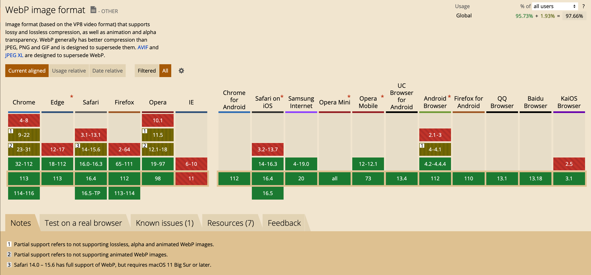
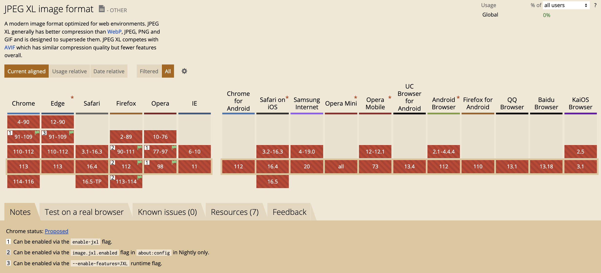
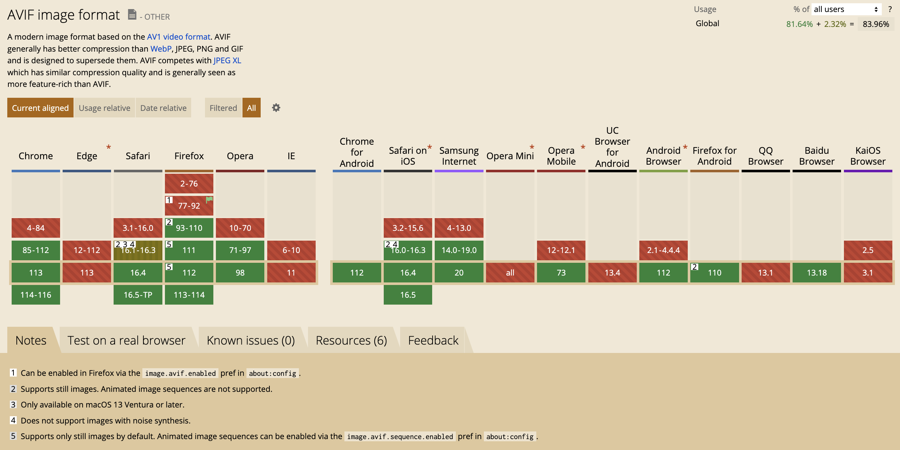
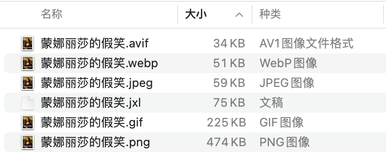
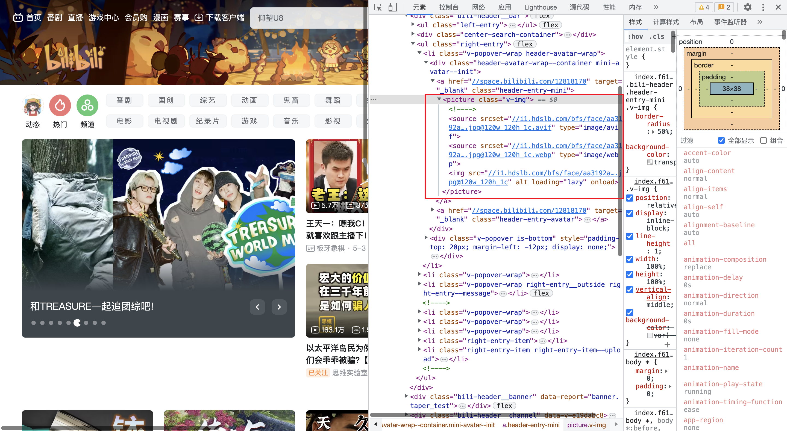
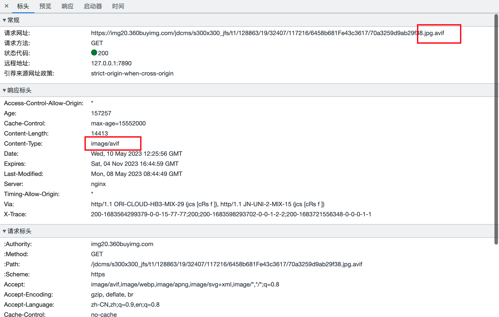

在前端页面中经常使用到各式各样的图片，这些图片在美化了页面的同时，也使得页面加载时间边长，带宽消耗增加，如果盲目在页面中堆砌大量图片，不仅会导致页面性能下降，移动端的用户也打呼流量遭不住！

<!-- truncate -->

## 图片格式

在聊图片性能优化之前，我们先看看在业务中我们可能会用的图片格式。目前主流的图片格式无非就是 '.jpg'、'.png'、'.gif'。这些图片格式各有特点，但是都有自己无法弥补的短板。除了这些“传统图片格式”外，还应该关注几个比较“新”的图片格式。

### `WebP`

webp是谷歌的亲儿子，文件后缀为`.webp`，2010年9月发布的图片格式，要说这种格式比较新，确实很牵强，但是很多coder还是没有用过它，不过webp确是一个非常优秀的图片格式，它的有损压缩压缩比例相较于jpg更加优秀，生成的图片更小，在网络传输中可以减少传输时间。另外webp支持alpha通道可以显示透明、半透明图像，支持动画类似于gif，支持有损、无损压缩。webp的优势在于有损压缩，无损压缩性能和表现一般。

> 相较于jpg，webp的编码速度慢10倍，解码慢1.5倍。虽然会增加解码时间，但是由于文件体积大幅减小，缩短了网络传输时间，实际表现是优于jpg的

webp兼容性（截止2023-05-10）



### `JPEG XL`

JPEG XL是由JPEG标准制定的组织于2021年发布的，旨在成员JPEG的替代品，其扩展格式为`.jxl`。JPEG XL同样支持有损、无损压缩，支持jpeg无损转码，jpeg无损转码可减少20%文件体积，另外JPEG XL也支持渐进式解码

JPEG XL 兼容性(截止2023-05-10)



:::info
就技术而言，jpeg xl是非常优秀的，但是兼容性是硬伤（这么久了，我在[caniuse](https://caniuse.com)上就没见过0%兼容性的特性），之前Chrome91到Chrome109版本中，已经开始实验性支持`.jxl`格式，但是在Chrome110中又不支持了，理由是：人们对jpeg xl没多大兴趣
:::


### `AVIF`

AVIF是由开放媒体联盟（推出H264、AV1视频编码格式那个开放媒体联盟）于2019年发布的一种最新图片格式，该格式基于AV1视频解码器，源自视频帧。所以它天然的支持动画，另外还支持alpha通道，支持有损、无损压缩并且其性能也优于webp，略逊于jpeg，扩展后缀为`.avif`

AVIF 图片兼容性（截止2023-05-10）




下面通过一个表格，简单总结一下这几种图片格式在各个方面的对比。通过这个表格可以明显的发现，新生代图片都支持动画、alpha通道、也都支持有损、无损压缩，最大的差异体现在设备兼容性上

| 图片类型 | Alpha通道 | 动画   | 编解码性能 | 压缩算法    | 颜色支持             | 兼容性                       |
| -------- | --------- | ------ | ---------- | ----------- | -------------------- | ---------------------------- |
| GIF      | 支持      | 支持   | 较高       | 无损压缩    | 索引色（256）        | 所有                         |
| PNG      | 支持      | 不支持 | 较高       | 无损压缩    | 索引色（256）/直接色 | 所有                         |
| JPEG     | 不支持    | 不支持 | 较高       | 有损压缩    | 直接色               | 所有                         |
| WebP     | 支持      | 支持   | 较差       | 有/无损压缩 | 直接色               | 高版本浏览器                 |
| JPEG XL  | 支持      | 支持   | 渐进式解码 | 有/无损压缩 | 直接色               | 部分高版浏览器本开启实验功能 |
| AVIF     | 支持      | 支持   | 一般       | 有/无损压缩 | 直接色               | 高版本浏览器                 |

另外一张jpeg图片，通过工具转格式后可以明显发现，从文件体积上 `avif` < `webp` < `jpeg` < `jxl` < `gif` < `png`。 

从兼容性上看 `webp` > `avif` > `jxl`。从下面这种图也能看出来， jxl图片不仅浏览器不支持，mac也不支持。

> 这些图片是通过node工具 sharp 由jpeg文件生成的，jxl是使用在线工具生成的



## 图片格式选用

新生态图片格式压缩性能和支持的特性都非常棒，但是兼容性不是特别好，不能贸然在生产环境中使用。如果在项目中使用了不支持的图片格式，轻则毒火攻心，重则七窍流血，好吧开玩笑的，最多导致图片无法识别显示空白而已。但是图片无法正常展示，这确实是一个严重的事故了，毕竟会影响到用户使用。我考（参）察（考）了一些大厂的方法，总结了两种应用方式，分别是前端兼容处理和后端兼容处理

### 前端兼容处理

虽然新生代图片浏览器兼容性参差不齐，但是浏览器对H5的特性支持的还是挺好的，在H5中有一个新增元素 `picture`，它可以包含一个或者多个 `source` 标签，和一个 `img` 标签来为不同设备提供不同的图片，浏览器会选择最匹配的 `source` 元素，如果没有则使用 `img` 中的图片，这有点类似于js中的 `switch case default` 语法。下面是一个简单的前端兼容案例

```html
<picture>
  <source srcset="static/image.jxl" type="image/jxl"/>
  <source srcset="static/image.avif" type="image/avif"/>
  <source srcset="static/image.webp" type="image/webp"/>

  
</picture>
```

上述代码，浏览器会依次判断每一个 `source` 元素中的 `type` 属性，如果浏览器支持这种 `mimetype` 则加载并展示该图片，如果都不支持则展示最后的兜底 `img` 元素。需要注意的是，这里的 `type` 是文件的 [`mimeType`](https://developer.mozilla.org/zh-CN/docs/Web/HTTP/Basics_of_HTTP/MIME_types)，指定的 `type` 和文件 `mimeType` 类型匹配。另外需要注意的是，`source`中指定图片地址使用的是 `srcset` 属性，不是 `src` 也不是 `href`


👉🏻 值得一提的是哔哩哔哩就是使用的这种方式




### 后端兼容处理

后端兼容的原理是，当浏览器发起一个请求的时候，会在请求头里面携带accept字段，用于告知服务器可以接收并处理的文件 `mimeType`，在服务器端，收到浏览器发起的请求时，可以判断一下浏览器支持的 `mimeType`，然后根据这个 `accept` 返回一个浏览器能处理的**最优**的文件类型即可。

下面是一个伪代码，具体实现可以查看[github仓库](https://github.com/hec9527/blog/tree/master/demo/服务端图片兼容)

```js
router.get("/(.*)", (ctx) => {
  const mimeTypes = ["jxl", "avif", "webp"];
  const fileName = decodeURIComponent(ctx.path);
  const [baseName, fileExt] = fileName.split(".");
  const staticDir = path.join(__dirname, "../static/");
  const imageAccepts = ctx.accepts().filter((accept) => /image\/\w/.test(accept));

  for (mime of mimeTypes) {
    const _mimeType = `image/${mime}`;
    if (imageAccepts.includes(_mimeType)) {
      const _filePath = path.join(staticDir, `${baseName}.${mime}`);
      if (fs.statSync(_filePath).isFile()) {
        ctx.response.set("content-type", _mimeType);
        ctx.body = fs.createReadStream(_filePath);
      }
      return;
    }
  }

  const _filePath = path.join(staticDir, fileName);

  if (fs.statSync(_filePath).isFile()) {
     ctx.body = fs.createReadStream(_filePath);
     return;
  }

  return (ctx.response.status = 404);
});
```

👉🏻 值得一提的是京东就是这么干的

请求图片的地址包含两个后缀，.jpg.avif。当浏览器支持avif的时候返回avif图片，否则返回jpg



:::info 说明
简单对比一下前端兼容方案和后端兼容方案，前端兼容方案实现简单，对后端要求少，能上传和下载图片各种格式图片即可，依靠H5的Picture标签，兼容性非常棒。缺点就是对使用方限制比较大，严重依赖H5，css背景图案无法处理，微信小程序、原生应用、部分Hybrid应用等都不支持，另外兼容增还加了额外的代码，一张图片多个地址，这些地址字符也增加了不少文件体积。

相对后端做兼容是比较理想的方案，对使用方没有要求，依赖http头中的accept字段，无论是H5还是css甚至微信小程序、原生应用等都能支持，缺点就是后端需要改造资源服务，对每个请求针对性的处理。

所以，我其实是更倾向于后端去做兼容的（不是因为我是前端工程师，真的是后端去做收益大）
:::


## 图片懒加载

关于图片懒加载，之前已经写过一篇文章了，可以参考之前的一篇文章 👉🏻 [图片懒加载](../../02/03/图片懒加载/)

## DPI 适配

 `DPR`（Device Pixel Ratio），即设备像素比值，表示一个css像素和一个真是的物理像素的比值。同一张图片，在不同DPR设备上显示的效果不同，高DPR设备显示一张小图，显示效果较差，模糊不清，低DPR设备显示一张高DPR图片只会增加贷款消耗，对显示效果提升有限或者没有提升。所有针对不同DPR的设备，为他们提供不同的尺寸的图片即可统一不同设备的显示效果。

下面是一段CSS适配代码，可以在本地查看效果，在chrome调试工具中模拟不同dpr设备时可以展示不同图片


 ```css
#box {
  width: 300px;
  height: 300px;
  background-size: cover;
  background-image: url(https://via.placeholder.com/300x300/ccc);
}

@media (-webkit-device-pixel-ratio: 2) {
  #box {
    background-image: url(https://via.placeholder.com/600x600/f78);
  }
}

@media (-webkit-device-pixel-ratio: 3) {
  #box {
    background-image: url(https://via.placeholder.com/900x900/abf);
  }
}
```

```css
#box {
    /* 不支持 image-set 的浏览器*/
    background-image: url(https://via.placeholder.com/600x600/f78);

    /* 支持 image-set 的浏览器*/
    background-image: image-set(
        url(https://via.placeholder.com/300x300/ccc) 1x,
        url(https://via.placeholder.com/600x600/f78) 2x,
        url(https://via.placeholder.com/300x300/ccc) 3x
    );
}
```


html 适配

```html

```

## 域名分片

在http1中，浏览器会限制同一个域名的并发请求数量，通常是6个，在图片资源较多的情况下，后面的图片需要等前面的图片加载完成后才能开始，前面的图片会阻塞后续资源加载，增加页面整体的加载时间，可以将图片域名分布到其它域名下。查看 [京东](https://jd.com) 的资源加载情况可以发现，他的图片域名被分配到不同的域名，可以绕开浏览器对一个域名最多6个并发的限制，但是浏览器的并发也不是无限的，浏览器会显示每个标签页并发的请求数量，这个每个浏览器各不相同

大厂是如何进行域名分片我就不得而知了，不过我写了一个demo，可以简单模拟分片效果

```js
const container = document.querySelector("div")
const fragment = document.createDocumentFragment()

// 不使用域名分片
for (let i = 0; i < 20; i++) {
  const img = document.createElement("img")
  img.src = `http://p.hec9527.top/1.jpg?q=${i}&t=${+new Date()}`
  fragment.appendChild(img)
}

// 使用域名分片
// const domains = new Array(10).fill(0);
// const findDomain = () => domains.findIndex(domain => domain < 6)
// for (let i = 0; i < 20; i++) {
//   let index = findDomain();
//   if (index !== undefined) {
//     domains[index]++;
//     const img = document.createElement("img")
//     img.src = `http://p${index === 0 ? "" : index}.hec9527.top/1.jpg?q=${i}&t=${+new Date()}`
//     container.append(img);
//     img.onload = function () {
//       domains[index]--;
//     }
//   } else {
//     const img = document.createElement("img")
//     img.src = `http://p.hec9527.top/1.jpg?q=${i}&t=${+new Date()}`
//     fragment.append(img);
//   }
// }
container.append(fragment)
```