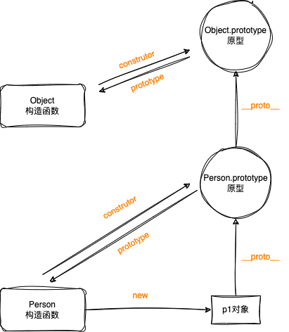

javascript 的继承不同于其他基于类继承的语言，它是基于原型的，那么什么是原型呢，它的继承又是怎么样的？

<!-- truncate -->

## 对象、原型、原型链

先看看对象，原型，和构造函数之间的关系，下面这张图可以很直观的看出来



### 构造函数

构造函数也是一个普通函数（**不能是箭头函数**），通常采用大驼峰命名法，函数内可以访问this，函数隐式返回this对象，如果手动返回内容会覆盖隐式返回的内容。另外构造函数内部可以通过 `new.target` 检测是否通过 `new` 运算符调用的，通过 `new` 调用返回对应的方法或者构造函数，否则返回undefined。

构造函数通过 prototype 指向构造函数的原型，使用 `new` 调用获取对象实例

### 对象

对象是通过构造函数创建出来的实例，每个实例都有一个 `__proto__` 属性指向他的原型（非标准）。

实例对象可以通过 `Object.getPrototypeOf(obj)` 实例的原型

### 原型

原型是一个对象，原型上的方法能被所有继承自该原型的实例所访问。原型可以通过 constructor 访问构造函数，所以

> Person.prototype.constructor === Person

### 原型链

原型是一个对象， 所以原型也有原型（Object除外，它的原型为null），一个个原型指向它自己的原型形成原型链。

当访问一个对象属性的时候，会先查看自身是否有该属性，如果没有就查询原型上是否有该属性，如果原型上没有但是原型上还有原型就查询原型的原型，以此类推，直到访问完整个原型链。

## 继承

### 原型链

```js title='基于原型链的继承'
function Person() {
  this.name = 'saga';
  this.books = ['English', 'Math', 'Physics'];
}

Person.prototype.sayName = function () {
  console.log(`my name is ${this.name}`);
};

function Student(age = 22) {
  this.age = age;
}

Student.prototype = new Person();
Student.prototype.sayAge = function () {
  console.log(`my age is ${this.age}`);
};
```

通过直接在原型链上添加属性和方法可以实现继承，但是他有很多问题

**缺点**
 1. 无法向原型传递参数，所有对象都具有相同的值
 2. 所有实例共享所有属性和方法


**优点**
 1. 可以使用 instanceof 检测

### 盗用构造函数

```js title='盗用构造函数'
// 省略Person构造函数定义...

function Student(age = 22, ...args) {
  Person.call(this, ...args);
  this.age = age;
}
Student.prototype.sayAge = function () {
  console.log(`my age is ${this.age}`);
};
```

在子类中调用父类的构造函数，构造出对象，初始化后返回

**缺点**
 1. 无法检测原型（无法检测出父类）
 2. 父构造函数绑定了this，无法访问父类原型上的属性和方法

**优点**
 1. 支持向原型上传递参数


### 组合继承

```js title='组合继承'
function Student() {
  Person.call(this);
  this.age = 32;
}
Student.prototype = new Person();
Student.prototype.sayAge = function () {
  console.log(`my age is ${this.age}`);
};
Student.prototype.constructor = Student; // 如果不指定构造函数，那么构造出来的对象为Person类型
```

在盗用构造函数的基础上，通过手动修改子类的原型来满足 instanceof 的检测

**缺点**
 1. 父类被实例化了两次，自身和父类都有父类的方法
 2. 需要手动修复构造函数指向，否则构建出来的为父类的实例

**优点**
 1. 支持 instanceof 检测原型链

### 寄生组合

```js title='寄生组合'
function Student(...args) {
  Person.apply(this, args);
  this.age = 123;
}
Student.prototype = Object.create(Person.prototype);
Student.prototype.constructor = Student;
```

**缺点**
 1. 需要手动修复构造函数指向，否则构造出来的是父类的实例

**优点**
 1. 支持 instanceof 检测原型
 2. 父类不用实例化两次

> 寄生组合，又称为圣杯继承， 这是一种比较完善的继承方式，当然这也是ES6中class继承的polyfill实现方式