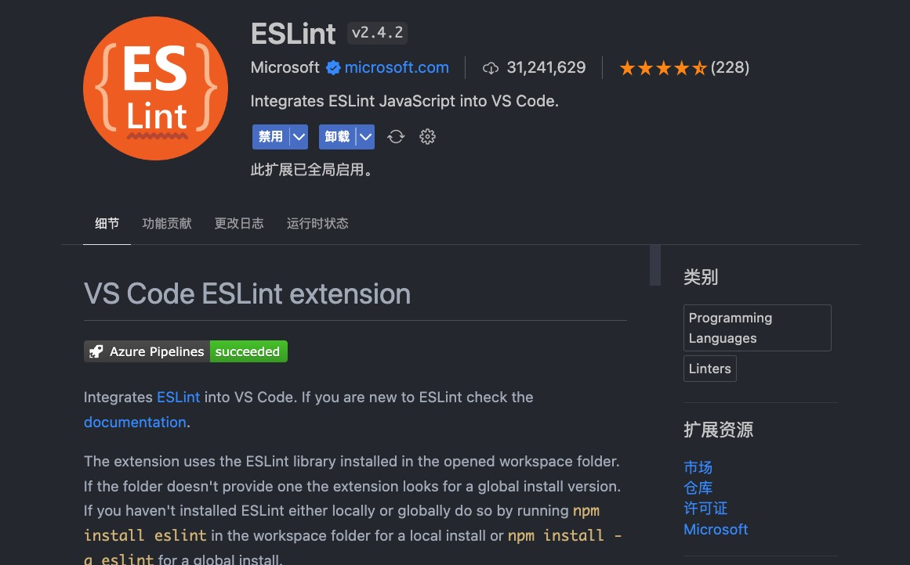

ESLint 是一个用于 JavaScript 和 JSX 代码静态分析的工具，可以帮助开发者发现和修复代码中的错误、不一致性以及潜在的问题。它可以检查代码中的语法错误、编码规范问题和潜在的逻辑错误，帮助团队保持一致的代码风格，并提高代码质量


<!-- truncate -->

eslint 的主要功能是代码规范检查，它能够根据预定义的规则对 js 代码进行静态代码分析和检查，及时发现潜在问题。另外它支持插件和配置，可以根据自身需要结合社区规则插件进行配置。在前端工程化中，可以非常方便的集成到编辑器以及构建流程当中

## 安装 & 使用

在项目中安装 eslint

```bash
npm install eslint --save-dev
```

### 命令行

在项目中安装 eslint 之后可以通过使用命令行进行检测和修复（非全局安装直接执行会报找不到 eslint, 在 npm script 中可以执行）

```bash
# 检测文件
eslint ./src/**/*.{js,jsx,ts,tsx}
# 检测并修复
eslint ./src/**/*.{js,jsx,ts,tsx} --fix
```

### vscode 插件

通常在 vscode 中会搭配 ESLint 插件来使用，在 vscode 插件市场搜索安装后，vscode 会实时显示 lint 信息，而不用每次手动 lint 文件。



在 vscode 配置文件中添加以下配置，在每次保存后自动修复 lint 问题

```json
{
  "editor.codeActionsOnSave": {
    "source.fixAll": true,
    "source.fixAll.lint": true
  }
}
```

## 配置 eslint

在项目根目录下创建 `eslint` 配置文件，并写入以下内容。或者使用 `npm init @eslint/config` 交互式创建 `eslint` 配置文件（**推荐**方式 👍🏻）

配置文件通常为 `.eslintrc`，当然也可以在 `package.json` 中添加 `eslintConfig` 配置项来配置 `eslint`。

```js
{
    "env": {
        "browser": true,
        "es2021": true
    },
    "extends": [
        "eslint:recommended",
        "plugin:@typescript-eslint/recommended",
        "plugin:react/recommended"
    ],
    "parser": "@typescript-eslint/parser",
    "parserOptions": {
        "ecmaVersion": "latest",
        "sourceType": "module"
    },
    "plugins": [
        "@typescript-eslint",
        "react"
    ],
    "rules": {
    }
}
```

eslint 配置文件格式有多种，但是只会使用其中一个配置文件，优先级如下

```text
.eslintrc.js
.eslintrc.cjs
.eslintrc.yaml
.eslintrc.yml
.eslintrc.json
package.json
```

## 配置项

### 环境配置（env）

指定代码运行的宿主环境，比如 Node.js、浏览器、ES6、CommonJS 等。配置对应环境后使用其中的语法、特性、全局变量不会报错

```json
{
  "env": {
    "browser": true,
    "node": true,
    "es6": true,
    "commonjs": true
  }
}
```

### 全局变量（globals）

指定全局变量，比如 jQuery 或者 React，通过配置全局变量来避免 eslint 将其视为未定义的变量。

> 其值为 `true` 表示该全局变量可读可写，为 `false` 表示可读不可写

```json
{
  "globals": {
    "jQuery": true,
    "React": false
  }
}
```

### 解析器（parser）

解析器是用于分析和理解代码的工具，解析器将代码转换为抽象语法树（AST），以便 eslint 能在其基础上进行静态分析和规则检查。

- `Espree`：一个轻量、快速的解析器， 是 eslint 默认解析器。至此 es5、es6、es7 等多个版本
- `@typescript-eslint/parser`：TypeScript 解析器，它可以解析 ts 的语法个注解
- `@babel/eslint-parser`：不仅支持最新的 Es 语法，还支持在实现性质中的语法以及 typescript、flow
- `vue-eslint-parser`：专门用于解析 Vue 单文件组件的解析器，它能够解析 Vue 的模板、脚本和样式，并提供对 Vue 特定语法的支持

```json title=".eslintrc"
{
  "parser": "@typescript-eslint/parser"
}
```

#### 解析器选项（parserOptions）

解析器选项是用于配置解析器的选项，比如指定解析器的版本，指定解析器的源码类型等。

```json
{
  "parserOptions": {
    "ecmaVersion": "esnext",
    "sourceType": "module", // or script
    // 使用的额外的语言特性  如jsx、tsx
    "ecmaFeatures": {
      "jsx": true,
      "tsx": true
    }
  }
}
```

### 继承(extends)和插件(plugins)

eslint 的规则太多了，以至于从头配置一个项目是如此的麻烦，好在社区有非常多的配置可以使用，我们只需要继承他们的规则，然后再根据需要进行修改即可。

`extends` 用于继承别人写好的配置规范，它可以配置一个字符串或者字符串数据，用于匹配对应的规则。继承的规则可以在 rules 属性中进行扩展或者覆盖

#### extends

`eslint` 内置了一套规则分为 `recommended` 和 `all`， `recommended` 包含了最常用的规则，比如 `no-console`、`no-debugger`、`no-alert` 等, `all` 则包含了当前版本的所有核心规则，all 会随着版本更新而便跟，不建议直接使用到生产环境

```json
{
  "extends": ["eslint:recommended"]
}
```

当然除了内置的 eslint 规则外，我们也可以继承外部的规则，比如 `airbnb` 规则，它包含了很多的规则，并且有对应的插件。

安装 `eslint-config-airbnb` 后，在配置文件中添加如下配置即可

```json
{
  "extends": ["airbnb"]
}
```

另外，eslint 规则中有很多包含代码格式化的规则，这些规则可能会跟常用的 prettier 规则有冲突，这是后我们可能会希望以 prettier 配置为准，那么可以尝试使用 `eslint-config-prettier`，它可以帮助我们关闭所有与 prettier 有冲突的规则。

某些插件也会导出一些规则，比如 `eslint-plugin-react`，它会导出 `react/recommended` 规则，我们只需要在配置文件中添加 `plugin:react/recommended` 即可。

```json
{
  "plugins": ["plugin:react/recommended"]
}
```

以下是一些常见的 eslint 配置包

| 名称                      | 作用                           |
| ------------------------- | ------------------------------ |
| eslint-config-airbnb      | 包含了 airbnb 规则             |
| eslint-config-prettier    | 解决 eslint 和 prettier 的冲突 |
| eslint-plugin-import      | 包含了模块导入、导出相关的规则 |
| eslint-plugin-react       | 包含 React 相关规则            |
| eslint-plugin-react-hooks | 包含 react hook 相关规则       |
| eslint-plugin-vue         | 包含 vue 的相关规则            |

#### plugins

eslint 支持使用第三方插件，允许扩展 eslint 的功能，比如：添加额外的规则、解析器、预处理器等。在使用插件时可以省略 `eslint-plugin-`

```json
{
  "plugins": ["react", "react-hooks", "@typescript-eslint"]
}
```

### 规则（rules）

eslint 附带了大量的规则，用于定义代码的规范和风格。规则告诉 eslint 应该对哪些代码发出警告或错误，可以根据自身需求进行配置

- `off | 0 `：关闭规则
- `warn | 1`： 触发规则后警告
- `error | 2`：触发规则后报告错误

## 禁用规则

有时候 eslint 报告了某些问题，但是我们并不打算处理它，或者只是想暂时关闭它，这时我们可以使用 `eslint-disable` 注释来禁用规则。

```js
// eslint-disable-next-line no-alert
alert('hello');
```

如果项目中某些文件或者目录不希望 eslint 去校验，可以在项目根目录创建 `.eslintignore` 文件来告诉 eslint 这些文件或者目录不用校验。

```bash
# 忽略所有node_modules目录下的文件
node_modules
# 忽略所有dist目录下的文件
dist
# 忽略任意层级的types目录
**/types
```

:::info

从零开始配置 eslint 比较麻烦，eslint 官方提供的初始化工具可以非常方便的初始化项目配置

```bash
npm init @eslint/config
# 或者
npx eslint --init
```

:::
