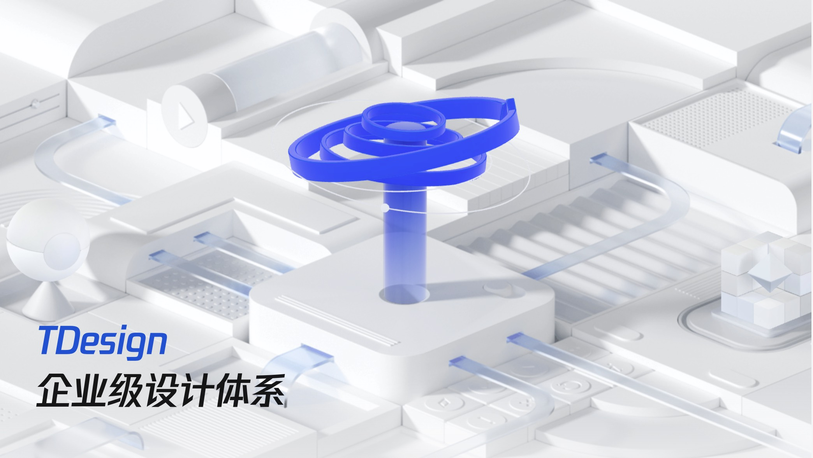

今天在看腾讯出品的TDesign组件库的时候，无意间发现他们的这个主题切换非常炫酷，现在主流的主题切换实现就是使用CSS变量，当点击切换主题的时候，通过CSS变量来切换主题，实现起来原理非常简单，但是这种实现方式页面的元素都是统一切换的，做不到腾讯TDesign这种效果，在简单查看其页面后发现一个大秘密...

<!-- truncate -->

## 效果展示

先简单看看腾讯组件库如丝般顺滑的切换效果，如果视频不能打开，可以直接访问 TDesign 组件库

👉🏻 [TDesign 组件库](https://tdesign.tencent.com/)

<video autoPlay muted loop style={{"width":"100%"}}>
  <source src="/video/tdesign.mov" type="video/mp4" />
</video>

## 原理分析

它这里其实是使用了一个DOM提供的叫做 `View Transitions API` 的API， 这个API提供了一种机制，它可以在更新DOM内容的同时，轻松地创建不同DOM状态之间的过渡动画，同时还提供了不同阶段的Promise，允许在视图到达指定阶段运行代码。它的用法如下:

```js
const transition = document.startViewTransition(callback);
```

浏览器会在执行`startViewTransition`时对当前屏幕截图， 然后执行callback回调，通常会在这里执行改变页面状态的代码，然后捕获页面的最新状态并且实时展示

总的来说，他的流程就是： `截图旧的页面` -> `执行callback改变页面状态` -> `用新的状态渲染页面并实时切换`

API会在页面切换的过程中构建出以下伪元素树，其中`::view-transition-old`为更改状态之前的元素内容，`::view-transition-new`为更改状态之后的元素内容

```text
::view-transition
└─ ::view-transition-group(root)
   └─ ::view-transition-image-pair(root)
      ├─ ::view-transition-old(root)
      └─ ::view-transition-new(root)
```


## 使用JS控制动画

执行startViewTransition返回的transition对象，通过transition.ready可以在伪元素创建并且即将开始播放动画时触发

```js
const transition = document.startViewTransition(() => {
    // update DOM status
});

// 等待伪元素创建完成：
transition.ready.then(() => {
// 新视图的根元素动画
    const width = window.innerWidth;
    const height = window.innerHeight;
    const buffer = width * 0.1;
    document.documentElement.animate(
        {
            clipPath: [
                `path('M ${-width} 0 L 0,0 L ${-buffer},${height} L ${-width - buffer * 2},${height}')`,
                `path('M 0 0 L ${width + buffer},0 L ${width},${height} L ${-buffer},${height}')`,
            ],
        },
        {
            duration: 500,
            easing: 'linear',
            pseudoElement: '::view-transition-new(root)',
        },
    );
});
```

通过上面这段代码即可实现类似于 TDesign 的过渡动画效果

 👉🏻 <a href="/css过渡动画/index.html" target="_blank">查看懒加载效果</a>

:::info 注意
有一点值得注意的，执行 startViewTransition 时页面截图，旧的页面状态不会再刷新了， 之前的动画等其他效果也不会再变化。这点可以在 TDesign 切换主题时看到， 当切换主题时，旧的页面中的gif图片停止播放，但是新的页面中的gif图片继续播放
:::

## 其他应用场景

在SPA应用中，路由切换时通常原始的页面就被销毁了，无法做到(vue可以)新的页面盖在旧的页面上，回退时新的页面弹出，旧的页面展示到顶层来这种效果。使用 `View Transitions API` 就很容易实现这个功能

## 兼容性

截止 2024年04月28，目前兼容性很一般，生产环境基本不可用，但是可以通过一些兼容性代码优雅降级

```js
// 不支持直接改变页面状态
if(!document.startViewTransition){
    // change page status
    return;
}

// 自持该API体验更加
const transition = document.startViewTransition(() => {
    // change page status
});

```


